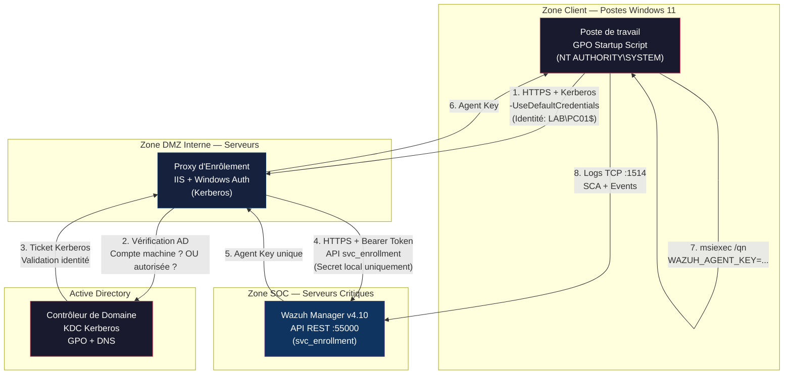

# 🔒 Rapport d'Audit DevSecOps — Infrastructure SOC/SIEM Wazuh v4.10
## Déploiement Zero-Touch par GPO Active Directory

**Auditeur :** Expert Senior DevSecOps / GRC  
**Date :** 2026-06-23  
**Classification :** Confidentiel — Usage Académique  
**Référentiels applicables :** NIST CSF 2.0, CIS Controls v8, OWASP Top 10, ISO 27001:2022, Directive NIS2 (UE 2022/2555)  
**Périmètre :** Architecture complète d'enrôlement automatisé Wazuh Agent (Windows 11) via GPO PowerShell + API REST  

---

## Table des matières

1. [Synthèse exécutive](#1-synthèse-exécutive)
2. [Revue critique globale — Analyse des vulnérabilités](#2-revue-critique-globale)
3. [Gestion des secrets — Analyse comparative des solutions](#3-gestion-des-secrets)
4. [Architecture cible recommandée](#4-architecture-cible-recommandée)
5. [Alignement GRC — ISO 27001 et NIS2](#5-alignement-grc)
6. [Matrice de traçabilité des risques](#6-matrice-de-traçabilité)
7. [Recommandations pour le portfolio](#7-recommandations-portfolio)

---

## 1. Synthèse exécutive

Le projet démontre une maturité technique croissante : le journal de bord révèle une capacité de diagnostic système réelle (caractères invisibles, matrices de compatibilité, gestion des ACLs Linux). Le pivot architectural depuis `authd.pass` vers l'API REST est intellectuellement justifié.

**Cependant, l'implémentation actuelle introduit des vulnérabilités plus graves que celles qu'elle prétend corriger.**

| Métrique | État actuel | Cible attendue |
|---|---|---|
| Secrets en clair dans le code | 🔴 **Critique** — Token Basic Auth hardcodé | 🟢 Zéro secret dans le script |
| Validation TLS | 🔴 **Critique** — Désactivée globalement | 🟢 Chain of Trust validée via PKI interne |
| Résilience du déploiement | 🟡 **Moyenne** — Aucun retry, race condition réseau | 🟢 Retry pattern + health check |
| Journalisation de l'enrôlement | 🟡 **Moyenne** — Dépend uniquement de Wazuh | 🟢 Logs locaux + centralisés |
| Principe du moindre privilège (API) | 🔴 **Critique** — Credentials admin full-access | 🟢 Compte de service dédié, RBAC |
| Révocabilité | 🟢 Bonne — Clé unique par agent | 🟢 Maintenu |

**Verdict global : le projet n'est pas déployable en l'état.** Trois vulnérabilités critiques doivent être corrigées avant toute mise en production, même en laboratoire.

---

## 2. Revue critique globale

### 2.1 — 🔴 CRITIQUE : Destruction de la chaîne de confiance TLS (CVSS 3.1 : 8.1)

```powershell
# ❌ Code actuel — Anti-pattern OWASP A07:2021 (Identification & Authentication Failures)
[System.Net.ServicePointManager]::ServerCertificateValidationCallback = {$true}
```

**Analyse :** Cette ligne désactive la validation des certificats SSL/TLS pour *l'intégralité du processus PowerShell*. Elle ne s'applique pas uniquement à ta requête vers l'API Wazuh, mais à **tout appel réseau** effectué par ce processus — et ce processus tourne en `NT AUTHORITY\SYSTEM`.

**Vecteur d'attaque concret :**
1. L'attaquant effectue un ARP Spoofing sur le segment réseau du lab
2. Il intercepte la requête HTTPS vers le port 55000 du Manager Wazuh
3. Il présente son propre certificat (accepté aveuglément par le callback)
4. Il capture le token Basic Auth en Base64 → décode `wazuh:wazuh`
5. Il dispose d'un accès administrateur complet à l'API du SIEM

> [!CAUTION]
> Un attaquant qui contrôle l'API de ton SIEM peut : supprimer des alertes, modifier les règles de détection, désactiver des agents, exfiltrer l'inventaire complet du parc. **Tu viens de donner les clés du SOC à l'adversaire.**

**Remédiation obligatoire :**

```powershell
# ✅ Solution : Déployer le certificat Root CA dans le magasin machine via GPO séparée
# Puis utiliser la validation native — AUCUN callback nécessaire

# Si certificat auto-signé (lab uniquement), épingler le thumbprint :
$expectedThumbprint = "A1B2C3D4E5F6..." # SHA-256 du cert du Manager
$uri = "https://wazuh-manager.lab.local:55000"

# Validation manuelle du certificat par thumbprint (Certificate Pinning)
$request = [System.Net.HttpWebRequest]::Create($uri)
$request.ServerCertificateValidationCallback = {
    param($sender, $cert, $chain, $sslPolicyErrors)
    return $cert.GetCertHashString("SHA256") -eq $expectedThumbprint
}
```

**Référentiels violés :**
- **CIS Control 3.10** : Chiffrer les données sensibles en transit
- **NIST SP 800-52 Rev2** : Guidelines for TLS Implementations
- **OWASP** : A07:2021 — Identification and Authentication Failures
- **ISO 27001:2022** : A.8.24 — Utilisation de la cryptographie

---

### 2.2 — 🔴 CRITIQUE : Credential Hardcodé avec privilèges excessifs (CVSS 3.1 : 9.1)

```powershell
# ❌ Code actuel — CWE-798 (Use of Hard-coded Credentials)
$headers = @{ Authorization = "Basic " + [Convert]::ToBase64String([Text.Encoding]::UTF8.GetBytes("wazuh:wazuh")) }
```

**Trois problèmes imbriqués :**

| # | Problème | Impact | CWE |
|---|---|---|---|
| 1 | Secret en clair dans le script | Lisible par toute machine du domaine sur le partage réseau | CWE-798 |
| 2 | Credentials par défaut non changées | `wazuh:wazuh` est le premier couple testé par n'importe quel scanner | CWE-1393 |
| 3 | Pas de principe du moindre privilège | Le compte `wazuh` est probablement admin de l'API → accès total | CWE-250 |

> [!IMPORTANT]
> **Même si tu sécurises le transport (TLS) et le stockage (coffre-fort), le compte `wazuh:wazuh` reste un compte par défaut avec des privilèges admin.** La première action, avant même de traiter le stockage du secret, est de **créer un compte de service dédié avec des permissions RBAC minimales** dans Wazuh (uniquement `agents:create` et `agents:read`).

**Action immédiate via l'API Wazuh :**

```bash
# 1. Authentification initiale (à faire une seule fois, manuellement)
TOKEN=$(curl -u wazuh:VraiMotDePasse -k -X POST "https://localhost:55000/security/user/authenticate" | jq -r '.data.token')

# 2. Créer un rôle minimaliste
curl -k -X POST "https://localhost:55000/security/roles" \
  -H "Authorization: Bearer $TOKEN" \
  -H "Content-Type: application/json" \
  -d '{"name": "enrollment_only", "rule": {"FIND": {"r'^agent$'": ["create", "read"]}}}'

# 3. Créer un utilisateur de service dédié
curl -k -X POST "https://localhost:55000/security/users" \
  -H "Authorization: Bearer $TOKEN" \
  -H "Content-Type: application/json" \
  -d '{"username": "svc_enrollment", "password": "P@ssw0rd-C0mpl3x-G3n3r4t3d!"}'

# 4. Associer le rôle à l'utilisateur
curl -k -X POST "https://localhost:55000/security/users/{user_id}/roles" \
  -H "Authorization: Bearer $TOKEN" \
  -d '{"role_ids": [<enrollment_role_id>]}'
```

---

### 2.3 — 🟡 MOYEN : Race Condition au boot (Fiabilité)

**Problème :** Le script est un *Startup Script* GPO. Il s'exécute dans la phase `Computer Startup`, **avant l'ouverture de session**, souvent avant la finalisation de la pile réseau (DHCP, DNS, NLA — Network Location Awareness).

**Conséquence :** L'appel `Invoke-RestMethod` échoue silencieusement → l'agent n'est jamais installé → le poste reste aveugle pour le SOC → **et personne ne le sait.**

**Remédiation :**

```powershell
# ✅ Retry pattern avec backoff exponentiel
function Wait-NetworkReady {
    param(
        [string]$Target = "wazuh-manager.lab.local",
        [int]$Port = 55000,
        [int]$MaxRetries = 5,
        [int]$InitialDelaySeconds = 5
    )
    
    for ($i = 1; $i -le $MaxRetries; $i++) {
        $delay = $InitialDelaySeconds * [Math]::Pow(2, $i - 1)
        try {
            $tcp = New-Object System.Net.Sockets.TcpClient
            $tcp.Connect($Target, $Port)
            $tcp.Close()
            Write-EventLog -LogName Application -Source "WazuhDeploy" `
                -EventId 1000 -EntryType Information `
                -Message "Connectivité réseau établie vers ${Target}:${Port} (tentative $i)"
            return $true
        } catch {
            Write-EventLog -LogName Application -Source "WazuhDeploy" `
                -EventId 1001 -EntryType Warning `
                -Message "Échec connectivité (tentative $i/$MaxRetries). Retry dans ${delay}s."
            Start-Sleep -Seconds $delay
        }
    }
    
    Write-EventLog -LogName Application -Source "WazuhDeploy" `
        -EventId 1002 -EntryType Error `
        -Message "ÉCHEC TOTAL : impossible de joindre ${Target}:${Port} après $MaxRetries tentatives."
    return $false
}
```

---

### 2.4 — 🟡 MOYEN : Absence de journalisation locale (Auditabilité)

Le script actuel ne produit aucune trace locale. En cas d'échec silencieux, tu n'as aucun moyen de diagnostic.

**Exigence ISO 27001:2022, A.8.15 — Journalisation :** *"Les activités, les exceptions, les défauts et les événements relatifs à la sécurité de l'information doivent être enregistrés."*

**Remédiation :** Chaque étape du script doit écrire dans l'Event Log Windows (`Application` ou un journal personnalisé `WazuhDeployment`). Cela permettra aussi à Wazuh, une fois installé, de remonter ses propres logs de déploiement — c'est de la méta-supervision.

---

### 2.5 — 🟡 MOYEN : Intégrité du MSI non vérifiée

Le MSI est stocké sur un partage réseau. Tu n'effectues aucune vérification d'intégrité (hash SHA-256) avant installation. Un attaquant ayant compromis le partage (ou un admin malveillant) peut remplacer le MSI par un binaire trojanisé.

**Remédiation :**

```powershell
# ✅ Vérification d'intégrité avant installation
$expectedHash = "E3B0C44298FC1C149AFBF4C8996FB92427AE41E4649B934CA495991B7852B855"
$msiPath = "\\DC01\WazuhDeploy$\wazuh-agent-4.10.4-1.msi"
$actualHash = (Get-FileHash -Path $msiPath -Algorithm SHA256).Hash

if ($actualHash -ne $expectedHash) {
    Write-EventLog -LogName Application -Source "WazuhDeploy" `
        -EventId 2000 -EntryType Error `
        -Message "ALERTE INTÉGRITÉ : Hash MSI invalide. Attendu=$expectedHash, Obtenu=$actualHash. Installation annulée."
    exit 1
}
```

**Référentiel :** CIS Control 2.5 — Allowlist Authorized Software ; NIST SP 800-167 — Software Supply Chain.

---

### 2.6 — 🔵 OBSERVATION : Le pivot API était-il justifié ?

Je te pose la question que ton jury te posera :

> *"Vous avez abandonné `authd.pass` car c'était un 'anti-pattern'. Mais vous l'avez remplacé par un token admin hardcodé en Base64 sur un partage lisible par tout le domaine. **En quoi est-ce un progrès ?**"*

Le mécanisme natif `authd` avec mot de passe d'enrôlement a un périmètre d'impact **limité** : il ne permet que l'enrôlement, pas l'administration du SIEM. Le token API admin, lui, donne le contrôle total.

**Mon avis :** Le pivot vers l'API est **la bonne direction architecturale** pour un projet de niveau Master, mais uniquement si tu résous la gestion des secrets. Sinon, `authd.pass` avec monitoring des enrôlements est objectivement plus sûr que l'état actuel.

---

## 3. Gestion des secrets

### Matrice comparative des solutions

Je classe les options par ordre de maturité croissante. Chaque option est évaluée sur 5 critères.

| Critère | Option 1 : Retour `authd` sécurisé | Option 2 : DPAPI Machine | Option 3 : gMSA + Proxy Kerberos | Option 4 : Certificats X.509 mutuels |
|---|---|---|---|---|
| **Sécurité** | ⭐⭐⭐ | ⭐⭐⭐ | ⭐⭐⭐⭐⭐ | ⭐⭐⭐⭐⭐ |
| **Complexité Lab** | ⭐ (triviale) | ⭐⭐⭐ | ⭐⭐⭐⭐ | ⭐⭐⭐⭐⭐ |
| **Zéro secret en clair** | ❌ (password dans MSI cmdline) | ✅ | ✅ | ✅ |
| **Natif AD/Windows** | ✅ | ✅ | ✅ | Partiel (PKI requise) |
| **Valeur portfolio** | Faible | Moyenne | **Très élevée** | Très élevée |
| **Adapté "Entreprise"** | Non | Partiel | **Oui** | Oui |

---

### Option 1 — Retour à `authd` avec monitoring compensatoire

**Principe :** Revenir au mécanisme natif `authd.pass`, mais le sécuriser correctement.

**Mise en œuvre :**
- Le mot de passe est passé via `msiexec` en paramètre `WAZUH_REGISTRATION_PASSWORD`
- Le mot de passe est complexe, rotatif (changé périodiquement)
- Wazuh est configuré pour générer une alerte **à chaque nouvel enrôlement** (rule ID custom)
- Un processus de revue périodique valide que chaque agent enrôlé correspond à une machine légitime de l'AD

**Verdict :** Acceptable pour un lab. Insuffisant pour un Master orienté DevSecOps car ça ne résout pas le problème fondamental : le secret est toujours dans la ligne de commande MSI (visible dans les logs `msiexec`, dans les processus, dans l'historique PowerShell, etc.).

---

### Option 2 — DPAPI Machine Scope (Windows natif)

**Principe :** Utiliser la Data Protection API de Windows pour chiffrer le secret avec la clé maître du compte machine. Seul le compte `SYSTEM` de cette machine spécifique peut déchiffrer.

**Mise en œuvre en deux temps :**

```powershell
# === PHASE 1 : Provisionnement (exécuté UNE FOIS par l'admin, via GPO "Immediate Task") ===
# Ce script chiffre le secret et le stocke dans un fichier local protégé

Add-Type -AssemblyName System.Security
$secret = [Text.Encoding]::UTF8.GetBytes("svc_enrollment:P@ssw0rd-C0mpl3x!")
$encrypted = [System.Security.Cryptography.ProtectedData]::Protect(
    $secret,
    $null,  # Entropy optionnelle
    [System.Security.Cryptography.DataProtectionScope]::LocalMachine
)
[IO.File]::WriteAllBytes("C:\ProgramData\WazuhDeploy\api_credential.bin", $encrypted)

# Verrouiller les ACLs
$acl = Get-Acl "C:\ProgramData\WazuhDeploy\api_credential.bin"
$acl.SetAccessRuleProtection($true, $false)  # Désactiver l'héritage
$rule = New-Object System.Security.AccessControl.FileSystemAccessRule(
    "NT AUTHORITY\SYSTEM", "Read", "Allow")
$acl.AddAccessRule($rule)
Set-Acl -Path "C:\ProgramData\WazuhDeploy\api_credential.bin" -AclObject $acl
```

```powershell
# === PHASE 2 : Script Startup GPO (déchiffrement à la volée) ===
Add-Type -AssemblyName System.Security
$encrypted = [IO.File]::ReadAllBytes("C:\ProgramData\WazuhDeploy\api_credential.bin")
$decrypted = [System.Security.Cryptography.ProtectedData]::Unprotect(
    $encrypted,
    $null,
    [System.Security.Cryptography.DataProtectionScope]::LocalMachine
)
$credential = [Text.Encoding]::UTF8.GetString($decrypted)
# $credential contient maintenant "svc_enrollment:P@ssw0rd-C0mpl3x!" en mémoire uniquement
```

**Forces :** Natif Windows, aucune dépendance externe, chiffrement AES-256 sous le capot.  
**Faiblesses :** Le fichier `.bin` doit être provisionné sur chaque machine. Tout admin local peut déchiffrer (car `LocalMachine` scope). Le secret est le même partout — si une machine est compromise, le secret l'est pour toutes.

---

### Option 3 — 🔥 Proxy d'enrôlement avec authentification Kerberos (Recommandée)

**C'est la solution que je recommande pour ton Master. C'est aussi celle qui impressionnera ton jury.**

**Principe fondamental :** Aucun endpoint ne connaît le secret de l'API Wazuh. L'authentification repose sur l'identité AD du compte machine, validée par Kerberos — un mécanisme où **aucun mot de passe ne transite sur le réseau**.

```
┌──────────────────┐         Kerberos/NTLM          ┌───────────────────────┐        API Token        ┌──────────────────┐
│   Poste Client   │  ──── (UseDefaultCredentials) ──►  Proxy d'Enrôlement  │ ──── (Secret local) ──► │  Wazuh Manager   │
│   (SYSTEM)       │         Identité: PC01$         │  (IIS / Flask / Go)  │                         │  API :55000      │
│                  │ ◄──── Clé Agent unique ──────── │                      │ ◄── Agent Key ───────── │                  │
└──────────────────┘    Zéro secret côté client      └───────────────────────┘   Secret isolé ici      └──────────────────┘
                                                              │
                                                     Vérifications :
                                                     ✓ L'appelant est un compte machine AD ($)
                                                     ✓ L'appelant est dans l'OU autorisée
                                                     ✓ L'appelant n'a pas déjà un agent enrôlé
                                                     ✓ Journalisation de chaque demande
```

**Implémentation (IIS + PowerShell, 100% natif Windows Server) :**

Le Proxy est un simple site IIS avec Windows Authentication activée, hébergeant un script PowerShell (via un module PowerShell Web API, ou un simple `.aspx`/`.ashx`).

```powershell
# === Script côté Proxy (simplifié — logique métier) ===

# 1. Récupérer l'identité Kerberos de l'appelant
$callerIdentity = [System.Security.Principal.WindowsIdentity]::GetCurrent()
# En contexte IIS avec Windows Auth : $callerIdentity = $HttpContext.User.Identity
$callerName = $callerIdentity.Name  # Exemple : "LAB\PC01$"

# 2. Vérifier que c'est bien un compte machine (se termine par $)
if ($callerName -notmatch '\$$') {
    # Rejeter : ce n'est pas un compte ordinateur
    Write-Output '{"error": "Unauthorized: not a machine account"}' 
    return
}

# 3. Vérifier l'appartenance à l'OU autorisée via LDAP
$computerName = ($callerName -split '\\')[1].TrimEnd('$')
$adComputer = Get-ADComputer -Identity $computerName -Properties DistinguishedName
if ($adComputer.DistinguishedName -notlike "*OU=Workstations,DC=lab,DC=local*") {
    Write-Output '{"error": "Unauthorized: computer not in authorized OU"}'
    return
}

# 4. Le secret API est stocké UNIQUEMENT ici, en variable d'environnement système
$apiPassword = [Environment]::GetEnvironmentVariable("WAZUH_API_SECRET", "Machine")
$tokenResponse = Invoke-RestMethod -Uri "https://wazuh-mgr:55000/security/user/authenticate" `
    -Method POST -Credential (New-Object PSCredential("svc_enrollment", (ConvertTo-SecureString $apiPassword -AsPlainText -Force)))

# 5. Créer l'agent et renvoyer la clé
$body = @{ name = $computerName; ip = "any" } | ConvertTo-Json
$agent = Invoke-RestMethod -Uri "https://wazuh-mgr:55000/agents" `
    -Method POST -Headers @{ Authorization = "Bearer $($tokenResponse.data.token)" } `
    -Body $body -ContentType "application/json"

# 6. Journaliser
Write-EventLog -LogName Application -Source "WazuhProxy" -EventId 3000 `
    -Message "Agent créé : $computerName (ID: $($agent.data.id)) — Demandeur: $callerName"

# 7. Renvoyer la clé au client
Write-Output ($agent | ConvertTo-Json)
```

```powershell
# === Script côté Client (GPO Startup) — AUCUN SECRET ===

# Vérification préalable
if (Get-Service -Name WazuhSvc -ErrorAction SilentlyContinue) { exit 0 }

# Appel au proxy — l'authentification est automatique via Kerberos
$response = Invoke-RestMethod -Uri "https://wazuh-proxy.lab.local/api/enroll" `
    -UseDefaultCredentials  # ← Le compte machine s'authentifie via Kerberos. Zéro secret.

$agentKey = $response.data.key

# Installation du MSI
$msiPath = "\\DC01\WazuhDeploy$\wazuh-agent-4.10.4-1.msi"
$expectedHash = "E3B0C44298FC..." 
$actualHash = (Get-FileHash $msiPath -Algorithm SHA256).Hash
if ($actualHash -ne $expectedHash) { exit 1 }

msiexec.exe /i $msiPath /qn `
    WAZUH_MANAGER="wazuh-manager.lab.local" `
    WAZUH_AGENT_KEY="$agentKey"
```

> [!TIP]
> **Pourquoi cette architecture est supérieure :**
> - **Zéro secret côté client** — Même si le script est lu par un attaquant, il n'obtient rien
> - **Authentification forte** — Kerberos est un protocole à preuve de connaissance nulle ; aucun mot de passe ne transite
> - **Imputabilité** — Chaque enrôlement est tracé avec l'identité AD exacte du demandeur
> - **Contrôle d'accès granulaire** — Le Proxy vérifie l'OU, peut vérifier un groupe AD, peut rate-limiter
> - **Révocation** — Supprimer le compte machine de l'AD = plus d'enrôlement possible
> - **Surface d'attaque réduite** — Le secret API n'existe que sur un seul serveur, pas sur N postes

---

### Option 4 — Authentification mutuelle TLS (mTLS) par certificats X.509

**Principe :** Chaque machine reçoit un certificat client émis par la PKI AD CS (Active Directory Certificate Services). Le Manager Wazuh valide ce certificat avant d'accepter l'enrôlement.

**Complexité :** Très élevée. Nécessite une PKI opérationnelle, des templates de certificats machine, la configuration de Wazuh pour du mTLS (non nativement supporté sur l'API REST sans reverse proxy).

**Verdict :** Overkill pour un lab. Mentionner comme évolution possible dans le mémoire, ne pas implémenter sauf si tu disposes déjà d'AD CS.

---

## 4. Architecture cible recommandée

### Diagramme d'architecture sécurisée



### Checklist de durcissement du script final

- [ ] ✅ Vérification d'existence du service (`WazuhSvc`)
- [ ] ✅ Attente réseau avec retry exponentiel et journalisation EventLog
- [ ] ✅ Authentification Kerberos via `-UseDefaultCredentials` (zéro secret)
- [ ] ✅ Validation TLS stricte (cert pinning ou Root CA déployée)
- [ ] ✅ Vérification d'intégrité SHA-256 du MSI
- [ ] ✅ Journalisation locale de chaque étape (succès, échec, hash)
- [ ] ✅ Code de sortie explicite pour chaque scénario d'erreur
- [ ] ❌ Aucun `ServerCertificateValidationCallback = {$true}`
- [ ] ❌ Aucun secret hardcodé
- [ ] ❌ Aucune utilisation de credentials par défaut

---

## 5. Alignement GRC

### 5.1 — Cartographie ISO 27001:2022

| Contrôle ISO 27001:2022 | Intitulé | Couverture par l'architecture |
|---|---|---|
| **A.5.9** | Inventaire des actifs informationnels | L'enrôlement automatique garantit une couverture exhaustive du parc. Chaque agent = un actif référencé dans Wazuh. |
| **A.5.15** | Contrôle d'accès | Le Proxy Kerberos implémente le moindre privilège : seuls les comptes machines de l'OU autorisée peuvent s'enrôler. Le compte API `svc_enrollment` a des droits RBAC restreints. |
| **A.5.17** | Informations d'authentification | Aucun secret en clair dans le code. Authentification par Kerberos (preuve de connaissance nulle). Secret API isolé sur le Proxy. |
| **A.5.23** | Sécurité de l'information pour l'utilisation de services Cloud | N/A (on-premise). |
| **A.5.28** | Collecte de preuves | Les Event Logs locaux + les logs Wazuh centralisés constituent une chaîne de preuves horodatées et immuables. |
| **A.8.9** | Gestion de la configuration | Le SCA Wazuh évalue en continu la conformité des configurations Windows par rapport aux benchmarks CIS. Les écarts génèrent des alertes. |
| **A.8.15** | Journalisation | Journalisation multi-niveaux : EventLog local du script, logs d'enrôlement du Proxy, logs d'audit Wazuh, alertes SCA. |
| **A.8.16** | Activités de surveillance | L'infrastructure SOC/SIEM Wazuh constitue le cœur de la surveillance continue. |
| **A.8.24** | Utilisation de la cryptographie | TLS 1.2+ pour tous les flux réseau. DPAPI pour le stockage local si Option 2. Kerberos AES-256 pour l'authentification. |

### 5.2 — Conformité NIS2 (Directive UE 2022/2555)

| Article NIS2 | Exigence | Réponse architecturale |
|---|---|---|
| **Art. 21 §2 (a)** | Politiques d'analyse des risques et de sécurité des systèmes d'information | Le SIEM Wazuh centralise les événements de sécurité. Le SCA automatise l'évaluation des risques de configuration. |
| **Art. 21 §2 (b)** | Gestion des incidents | Les règles de détection Wazuh + le dashboard Kibana permettent la détection, le triage et la réponse aux incidents. |
| **Art. 21 §2 (d)** | Sécurité de la chaîne d'approvisionnement | La vérification d'intégrité SHA-256 du MSI avant installation couvre le risque de supply chain compromise. |
| **Art. 21 §2 (e)** | Sécurité de l'acquisition, du développement et de la maintenance | Le déploiement Zero-Touch via GPO garantit une configuration homogène et reproductible. |
| **Art. 21 §2 (g)** | Pratiques de base en matière de cyberhygiène et formation | L'application automatique des benchmarks CIS via SCA constitue une cyberhygiène technique coercitive. |
| **Art. 21 §2 (i)** | Sécurité des ressources humaines, politiques de contrôle d'accès et gestion des actifs | L'enrôlement AD-based lie chaque agent à un objet ordinateur Active Directory → gestion des actifs native. |
| **Art. 21 §2 (j)** | Utilisation de solutions d'authentification multi-facteur ou d'authentification continue | Kerberos fournit une authentification forte sans mot de passe côté client (basée sur le secret machine du domaine). |

---

## 6. Matrice de traçabilité des risques

| ID | Risque identifié | Probabilité | Impact | Criticité | Remédiation | Statut |
|---|---|---|---|---|---|---|
| R-01 | Interception du token API via MitM (bypass TLS) | Moyenne | Critique | 🔴 **Critique** | Supprimer le callback, déployer Root CA ou cert pinning | À corriger |
| R-02 | Extraction du secret hardcodé depuis le partage réseau | Élevée | Critique | 🔴 **Critique** | Implémenter Option 3 (Proxy Kerberos) | À corriger |
| R-03 | Utilisation de credentials par défaut (`wazuh:wazuh`) | Élevée | Critique | 🔴 **Critique** | Créer `svc_enrollment` avec RBAC minimal | À corriger |
| R-04 | Échec silencieux du déploiement (race condition réseau) | Élevée | Moyen | 🟡 **Moyen** | Retry pattern + Event Log | À corriger |
| R-05 | MSI trojanisé sur le partage réseau | Faible | Critique | 🟡 **Moyen** | Vérification SHA-256 avant install | À corriger |
| R-06 | Agent non installé passant inaperçu | Moyenne | Moyen | 🟡 **Moyen** | Dashboard de conformité (% agents vs % machines AD) | À implémenter |
| R-07 | Incompatibilité de version Agent/Manager lors de mises à jour | Faible | Faible | 🟢 **Faible** | Documenter la matrice de compatibilité, tester en pré-prod | Documenté |

---

## 7. Recommandations pour le portfolio

### 7.1 — Structure de présentation recommandée

```
1. Contexte et enjeux (NIS2, surface d'attaque des endpoints)
2. Architecture initiale et ses limites (le journal de bord = honnêteté intellectuelle)
3. Analyse de risques (cette matrice)
4. Architecture cible sécurisée (diagramme Mermaid + justification)
5. Implémentation technique (code commenté, captures, tests)
6. Cartographie de conformité ISO 27001 / NIS2 (ces tableaux)
7. Limites et axes d'amélioration
```

### 7.2 — Arguments différenciants pour l'oral

> [!TIP]
> **Ce que le jury veut entendre :**
> 1. **"J'ai fait des erreurs et je les ai corrigées"** — Ton journal de bord est une force, pas une faiblesse. Il prouve une démarche itérative de type DevSecOps.
> 2. **"J'ai identifié que ma solution créait de nouveaux risques"** — Le pivot API sans gestion des secrets est pire que `authd`. Le reconnaître montre une pensée critique.
> 3. **"J'ai appliqué le principe de défense en profondeur"** — TLS + Kerberos + RBAC + intégrité MSI + journalisation = 5 couches.
> 4. **"Je sais cartographier mes choix techniques sur des référentiels"** — ISO 27001, NIS2, CIS Controls, CWE.
> 5. **"Je connais les limites de mon lab"** — Pas de PKI complète, pas de HSM, pas de SOAR. C'est OK si tu le dis.

### 7.3 — Axes d'amélioration à mentionner

- **SOAR :** Intégrer Shuffle ou TheHive pour l'orchestration et la réponse automatisée aux incidents
- **PKI complète :** Remplacer les certificats auto-signés par une infrastructure AD CS
- **mTLS :** Évoluer vers une authentification mutuelle par certificats machine
- **IaC :** Containeriser le déploiement Wazuh (Docker Compose → Ansible → Terraform)
- **CI/CD du script GPO :** Versionner le script dans Git, valider par code review avant déploiement
- **Monitoring du monitoring :** Dashboard de conformité Agent vs Parc AD (taux de couverture SOC)

---

> [!IMPORTANT]
> **Priorité d'actions (ordre strict) :**
> 1. 🔴 Changer les credentials par défaut `wazuh:wazuh` → créer `svc_enrollment` avec RBAC
> 2. 🔴 Supprimer le bypass TLS → déployer le Root CA via GPO
> 3. 🔴 Implémenter le Proxy d'enrôlement Kerberos (Option 3)
> 4. 🟡 Ajouter le retry pattern réseau
> 5. 🟡 Ajouter la vérification d'intégrité du MSI
> 6. 🟡 Implémenter la journalisation EventLog complète
> 7. 🟢 Documenter et cartographier pour le portfolio

---

*Fin du rapport d'audit. L'auditeur reste disponible pour la phase d'implémentation technique des remédiations.*
