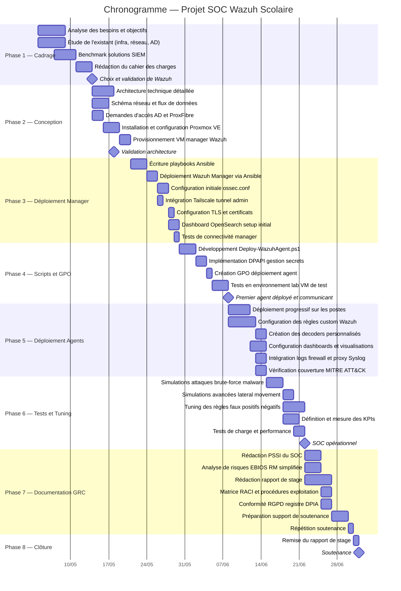
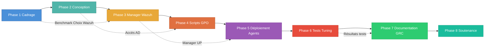

# Chronogramme du Projet — SOC Wazuh Scolaire

> **Projet** : Déploiement d'un SOC scolaire basé sur Wazuh  
> **Version** : 1.0  
> **Date** : Juin 2026  
> **Durée totale** : 8 semaines  
> **Classification** : Document académique — Usage pédagogique

---

## Vue d'ensemble

Ce document présente le chronogramme détaillé du projet de déploiement d'un SOC (Security Operations Center) basé sur Wazuh dans un environnement scolaire. Le projet s'étend sur **8 semaines** et couvre l'ensemble du cycle de vie : de l'analyse des besoins à la soutenance finale.

Le diagramme de Gantt ci-dessous illustre l'enchaînement des phases, les dépendances entre tâches et les jalons clés du projet.

---

## Diagramme de Gantt

---

## Description détaillée des phases

### Phase 1 — Cadrage et analyse (Semaines 1-2)

| Élément | Détail |
|---------|--------|
| **Objectif** | Comprendre le contexte, analyser l'existant et valider le choix de la solution SIEM |
| **Activités clés** | Entretiens avec l'équipe IT, cartographie de l'infrastructure existante (AD, réseau, postes), benchmark des solutions SIEM open source (Wazuh, ELK Stack/Security, Splunk Free), rédaction du cahier des charges |
| **Livrables** | Cahier des charges, note de cadrage, compte-rendu de benchmark |
| **Jalon** | ✅ **Choix et validation de Wazuh** comme solution SIEM retenue |
| **Dépendances** | Aucune — phase initiale du projet |
| **Risques** | Accès limité à la documentation de l'infrastructure existante, indisponibilité des interlocuteurs |

**Points d'attention** :
- L'étude de l'existant doit inventorier précisément : nombre de postes, version Windows, structure AD (OUs), topologie réseau (VLANs), équipements de sécurité en place
- Le benchmark doit évaluer les critères : coût (open source vs propriétaire), facilité de déploiement, communauté, intégration AD/GPO, conformité RGPD
- La validation du choix de Wazuh nécessite l'accord du tuteur technique et du responsable informatique de l'école

---

### Phase 2 — Conception et architecture (Semaines 2-3)

| Élément | Détail |
|---------|--------|
| **Objectif** | Concevoir l'architecture technique complète et préparer l'infrastructure de virtualisation |
| **Activités clés** | Design de l'architecture (manager, agents, flux réseau), création des schémas techniques, demandes d'accès (AD admin, ProxFibre), installation de Proxmox VE, provisionnement de la VM |
| **Livrables** | Dossier d'architecture technique (DAT), schémas réseau, matrice des flux |
| **Jalon** | ✅ **Validation de l'architecture** par le tuteur technique |
| **Dépendances** | Phase 1 (choix de la solution validé) |
| **Risques** | Délais d'obtention des accès AD/ProxFibre, contraintes réseau (ports bloqués, VLANs non configurés) |

**Points d'attention** :
- L'architecture doit prévoir : la VM manager (CPU, RAM, stockage), les flux réseau (1514/TCP, 1515/TCP, 443/TCP), la segmentation réseau (VLAN serveurs), le tunnel Tailscale
- Les demandes d'accès doivent être anticipées car les délais administratifs peuvent être longs en environnement scolaire
- Le dimensionnement de la VM dépend du nombre d'agents prévu (estimer 50-200 postes)

---

### Phase 3 — Déploiement du Manager Wazuh (Semaines 3-4)

| Élément | Détail |
|---------|--------|
| **Objectif** | Déployer et configurer le manager Wazuh de manière automatisée et reproductible |
| **Activités clés** | Écriture des playbooks Ansible (installation Wazuh, configuration `ossec.conf`, TLS, Tailscale), déploiement du manager, configuration du dashboard OpenSearch, tests de connectivité |
| **Livrables** | Playbooks Ansible versionnés, manager Wazuh opérationnel, dashboard accessible, documentation de déploiement |
| **Jalon** | Manager Wazuh fonctionnel et accessible via Tailscale |
| **Dépendances** | Phase 2 (VM provisionnée, accès réseau configurés) |
| **Risques** | Problèmes de compatibilité Ansible/OS, certificats TLS invalides, tunnel Tailscale instable |

**Points d'attention** :
- Les playbooks doivent être **idempotents** : relancer le déploiement ne doit pas casser la configuration existante
- Le fichier `ossec.conf` doit utiliser des placeholders (`{{WAZUH_MANAGER_IP}}`, `{{CLUSTER_KEY}}`) pour le repository public
- L'intégration Tailscale doit être testée depuis un réseau externe pour valider l'accès distant
- Les certificats TLS doivent être générés et distribués de manière sécurisée

---

### Phase 4 — Scripts GPO et tests en lab (Semaines 4-5)

| Élément | Détail |
|---------|--------|
| **Objectif** | Créer les scripts de déploiement automatisé des agents et les valider en environnement contrôlé |
| **Activités clés** | Développement du script `Deploy-WazuhAgent.ps1`, implémentation du chiffrement DPAPI pour les secrets, création de la GPO de déploiement, tests sur VMs de lab |
| **Livrables** | Script PowerShell validé, GPO configurée, rapport de tests lab |
| **Jalon** | ✅ **Premier agent déployé** et communicant avec le manager |
| **Dépendances** | Phase 3 (manager opérationnel et joignable) |
| **Risques** | Incompatibilités PowerShell entre versions Windows, blocage par l'antivirus, droits insuffisants sur l'AD |

**Points d'attention** :
- Le script doit gérer : le téléchargement du MSI, l'installation silencieuse, la configuration de l'agent (`ossec.conf`), l'enregistrement auprès du manager, le démarrage du service
- DPAPI est utilisé pour stocker la clé d'enregistrement (`authd`) de manière sécurisée dans le contexte machine
- Les tests en lab doivent couvrir : Windows 10/11, poste déjà équipé d'un agent, poste sans connectivité au manager, double exécution de la GPO (idempotence)
- La GPO doit cibler une OU de test avant le déploiement généralisé

---

### Phase 5 — Déploiement des agents et personnalisation (Semaines 5-6)

| Élément | Détail |
|---------|--------|
| **Objectif** | Déployer les agents sur l'ensemble des postes et personnaliser la détection |
| **Activités clés** | Déploiement progressif (par OU/VLAN), création de règles custom Wazuh, développement de decoders personnalisés, configuration des dashboards de supervision, intégration des logs tiers (firewall, proxy) |
| **Livrables** | Agents déployés sur X postes, règles custom documentées, dashboards opérationnels, matrice de couverture MITRE ATT&CK |
| **Jalon** | Couverture complète des postes cibles |
| **Dépendances** | Phase 4 (script et GPO validés en lab) |
| **Risques** | Surcharge réseau lors du déploiement massif, faux positifs excessifs, incompatibilité avec certains postes |

**Points d'attention** :
- Le déploiement doit être **progressif** : commencer par 10-20 postes, valider le fonctionnement, puis étendre par vagues
- Les règles custom doivent cibler les menaces pertinentes en contexte scolaire : installation de logiciels non autorisés, tentatives de contournement du proxy, brute-force sur les comptes élèves
- Les dashboards doivent offrir une vue synthétique : nombre d'alertes par criticité, top 10 des règles déclenchées, postes les plus alertants, couverture MITRE ATT&CK
- L'intégration Syslog (firewall, proxy) enrichit la corrélation et permet la détection de menaces réseau

---

### Phase 6 — Tests de détection et tuning (Semaines 6-7)

| Élément | Détail |
|---------|--------|
| **Objectif** | Valider la capacité de détection du SOC et optimiser les règles pour réduire les faux positifs |
| **Activités clés** | Simulations d'attaques structurées (Kill Chain), tests de brute-force, exécution de malware de test (EICAR), mouvement latéral simulé, tuning des règles, définition et mesure des KPIs de performance |
| **Livrables** | Rapport de tests de détection, matrice de couverture validée, KPIs documentés, règles optimisées |
| **Jalon** | ✅ **SOC opérationnel** — taux de détection validé, faux positifs maîtrisés |
| **Dépendances** | Phase 5 (agents déployés, règles configurées) |
| **Risques** | Simulations d'attaques déclenchant des alertes réelles (communication préalable nécessaire), tuning insuffisant générant de la fatigue d'alerte |

**Points d'attention** :
- Les simulations doivent être **autorisées et encadrées** : accord écrit du responsable IT, fenêtre de test définie, postes de test isolés si possible
- Scénarios de test recommandés :
  - 🔴 **Brute-force** : tentatives de connexion multiples sur un compte AD
  - 🔴 **Malware** : exécution du fichier test EICAR, scripts PowerShell obfusqués
  - 🔴 **Mouvement latéral** : utilisation de PsExec, WMI remote, pass-the-hash
  - 🔴 **Exfiltration** : transfert de fichiers volumineux, tunneling DNS
  - 🔴 **Persistence** : création de tâches planifiées, modification du registre Run
- KPIs à mesurer : MTTD (Mean Time To Detect), taux de faux positifs, taux de couverture ATT&CK, nombre d'alertes par jour/par criticité

---

### Phase 7 — Documentation et GRC (Semaines 7-8)

| Élément | Détail |
|---------|--------|
| **Objectif** | Produire la documentation de gouvernance, rédiger le rapport de stage et préparer la soutenance |
| **Activités clés** | Rédaction de la PSSI du SOC, analyse de risques EBIOS RM, rédaction du rapport de stage, création de la matrice RACI, conformité RGPD (registre de traitement, DPIA), préparation du support de soutenance |
| **Livrables** | PSSI, analyse de risques, rapport de stage complet, matrice RACI, registre de traitement RGPD, support de soutenance |
| **Jalon** | Documentation complète validée par le tuteur |
| **Dépendances** | Phase 6 (SOC opérationnel, résultats des tests disponibles) |
| **Risques** | Manque de temps pour la rédaction, retours tardifs du tuteur |

**Points d'attention** :
- Le rapport de stage doit couvrir : contexte et problématique, état de l'art, architecture technique, réalisations, tests et résultats, bilan et perspectives
- La PSSI doit être adaptée au contexte scolaire et rester opérationnelle (pas un document théorique)
- L'analyse EBIOS RM peut être simplifiée (3 ateliers sur 5) pour rester proportionnée au périmètre du projet
- Prévoir au minimum **une répétition** de la soutenance avec le tuteur

---

### Phase 8 — Clôture et soutenance (Semaine 8)

| Élément | Détail |
|---------|--------|
| **Objectif** | Soutenir le projet devant le jury et remettre l'ensemble des livrables |
| **Activités clés** | Finalisation et remise du rapport de stage, soutenance orale (présentation + questions du jury) |
| **Livrables** | Rapport de stage final (version imprimée et numérique), support de soutenance |
| **Jalon** | ✅ **Soutenance** — présentation devant le jury |
| **Dépendances** | Phase 7 (documentation complète, rapport validé) |
| **Risques** | Stress, problèmes techniques lors de la démo live |

**Points d'attention** :
- Préparer une **démo live** du dashboard Wazuh montrant des alertes en temps réel
- Avoir un **plan B** (captures d'écran, vidéo) en cas de problème de connectivité
- Structurer la soutenance : 5 min contexte, 10 min réalisations techniques, 5 min résultats et KPIs, 5 min bilan et perspectives, 10-15 min questions

---

## Matrice des dépendances

Le tableau ci-dessous synthétise les dépendances entre les phases du projet :

| Phase amont | Phase aval | Nature de la dépendance |
|-------------|-----------|------------------------|
| Phase 1 — Cadrage | Phase 2 — Conception | Le choix de la solution SIEM conditionne l'architecture technique |
| Phase 2 — Conception | Phase 3 — Manager | La VM Proxmox et les accès réseau doivent être provisionnés |
| Phase 3 — Manager | Phase 4 — Scripts & GPO | Le manager doit être opérationnel pour tester l'enregistrement des agents |
| Phase 4 — Scripts & GPO | Phase 5 — Déploiement | Le script et la GPO doivent être validés en lab avant le déploiement en production |
| Phase 5 — Déploiement | Phase 6 — Tests | Les agents doivent être déployés pour exécuter les simulations d'attaques |
| Phase 6 — Tests | Phase 7 — Documentation | Les résultats des tests alimentent le rapport de stage et les documents GRC |
| Phase 7 — Documentation | Phase 8 — Soutenance | Le rapport et le support de soutenance doivent être finalisés avant la soutenance |
| Phase 2 — Conception | Phase 4 — Scripts & GPO | Les accès AD sont nécessaires pour créer la GPO (dépendance transverse) |
| Phase 3 — Manager | Phase 5 — Déploiement | Le manager doit rester accessible pendant toute la durée du déploiement |

---

## Jalons clés du projet

| # | Jalon | Phase | Date prévisionnelle | Critères de validation |
|---|-------|-------|--------------------|-----------------------|
| M1 | **Choix et validation de Wazuh** | Phase 1 | Fin semaine 2 | Cahier des charges validé, benchmark documenté, accord du tuteur |
| M2 | **Validation de l'architecture** | Phase 2 | Fin semaine 3 | DAT validé, VM provisionnée, accès AD et ProxFibre obtenus |
| M3 | **Premier agent déployé** | Phase 4 | Fin semaine 5 | Agent communicant avec le manager, logs visibles dans le dashboard |
| M4 | **SOC opérationnel** | Phase 6 | Fin semaine 7 | Taux de détection ≥ 80%, faux positifs < 20%, dashboards opérationnels |
| M5 | **Soutenance** | Phase 8 | Semaine 8 | Rapport remis, présentation effectuée, questions du jury traitées |

---

## Indicateurs de suivi

Pour assurer le bon déroulement du projet, les indicateurs suivants sont suivis hebdomadairement :

| Indicateur | Cible | Méthode de mesure |
|------------|-------|-------------------|
| Avancement global | Selon planning Gantt | % de tâches terminées par phase |
| Nombre d'agents déployés | 100% des postes cibles | Dashboard Wazuh — agents connectés |
| Taux de détection | ≥ 80% des scénarios de test | Ratio alertes générées / attaques simulées |
| Taux de faux positifs | < 20% des alertes totales | Analyse manuelle des alertes sur 7 jours |
| Couverture MITRE ATT&CK | ≥ 15 techniques couvertes | Matrice de couverture documentée |
| Respect des délais | 0 jour de retard | Comparaison planning prévisionnel / réel |

---

> **Note** : Ce chronogramme est un document de référence, ajustable en fonction des contraintes rencontrées en cours de projet. Toute modification significative du planning doit être validée avec le tuteur technique et documentée dans le rapport de stage.
