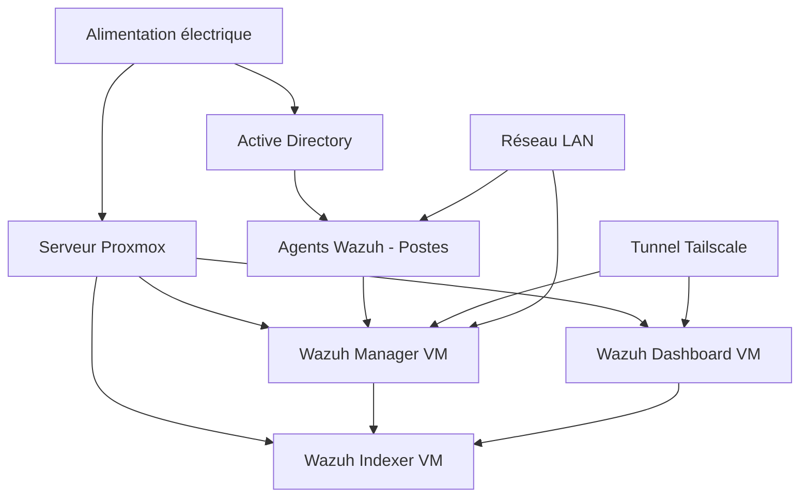

# Plan de Continuité et de Reprise d'Activité (PCA/PRA)

**Projet** : SOC Scolaire — Déploiement Wazuh  
**Version** : 1.0  
**Date** : 29/06/2026  
**Classification** : Diffusion restreinte  
**Auteur** : `<NOM_AUTEUR>`  
**Établissement** : `<NOM_ETABLISSEMENT>`  

---

## Table des matières

1. [Objet et périmètre](#1-objet-et-périmètre)
2. [Objectifs de continuité — RPO et RTO](#2-objectifs-de-continuité--rpo-et-rto)
3. [Analyse d'impact sur l'activité (BIA)](#3-analyse-dimpact-sur-lactivité-bia)
4. [Scénarios de sinistre](#4-scénarios-de-sinistre)
5. [Procédures de continuité (PCA)](#5-procédures-de-continuité-pca)
6. [Procédures de reprise (PRA)](#6-procédures-de-reprise-pra)
7. [Sauvegardes et restauration](#7-sauvegardes-et-restauration)
8. [Tests et exercices](#8-tests-et-exercices)
9. [Matrice de communication de crise](#9-matrice-de-communication-de-crise)
10. [Maintenance du plan](#10-maintenance-du-plan)
11. [Annexes](#11-annexes)

---

## 1. Objet et périmètre

### 1.1 Objet

Le présent document définit le **Plan de Continuité d'Activité (PCA)** et le **Plan de Reprise d'Activité (PRA)** pour l'infrastructure SOC scolaire basée sur Wazuh. Il vise à garantir la résilience du système de supervision de sécurité et à minimiser l'impact des sinistres sur la continuité pédagogique.

### 1.2 Périmètre

Le plan couvre les composants suivants :

| Composant | Criticité | Localisation | Responsable |
|---|---|---|---|
| Wazuh Manager | Critique | VM Proxmox — `<IP_MANAGER>` | `<ADMIN_SOC>` |
| Wazuh Indexer (OpenSearch) | Critique | VM Proxmox — `<IP_INDEXER>` | `<ADMIN_SOC>` |
| Wazuh Dashboard | Importante | VM Proxmox — `<IP_DASHBOARD>` | `<ADMIN_SOC>` |
| Agents Wazuh (postes Windows) | Importante | Parc informatique scolaire | `<ADMIN_AD>` |
| Active Directory (GPO) | Critique | `<IP_DC>` | `<ADMIN_AD>` |
| Tunnel Tailscale | Importante | Overlay réseau | `<ADMIN_SOC>` |
| Serveur Proxmox (hyperviseur) | Critique | Salle serveur — `<LOCALISATION>` | `<ADMIN_INFRA>` |
| Sauvegardes | Critique | `<EMPLACEMENT_BACKUP>` | `<ADMIN_INFRA>` |

### 1.3 Exclusions

- Les applications pédagogiques (ENT, logiciels métier) ne sont pas couvertes par ce plan
- Le réseau Internet externe (responsabilité du FAI `<NOM_FAI>`)

### 1.4 Documents de référence

| Document | Référence |
|---|---|
| Analyse de risques EBIOS RM | `analyse_risques_ebios_rm.md` |
| Politique de gestion des accès IAM | `politique_gestion_acces_iam.md` |
| Norme ISO 22301 — Systèmes de management de la continuité d'activité | ISO 22301:2019 |
| Guide ANSSI — Gestion de crise cyber | ANSSI-PA-071 |

---

## 2. Objectifs de continuité — RPO et RTO

### 2.1 Définitions

- **RPO (Recovery Point Objective)** : Durée maximale de perte de données acceptable (point de restauration le plus ancien)
- **RTO (Recovery Time Objective)** : Durée maximale d'interruption de service acceptable avant reprise
- **MTPD (Maximum Tolerable Period of Disruption)** : Durée maximale totale d'indisponibilité avant impact irréversible

### 2.2 Objectifs par composant

| Composant | RPO | RTO | MTPD | Justification |
|---|---|---|---|---|
| **Wazuh Manager** | 1 heure | 4 heures | 24 heures | Composant central de collecte — la perte prolongée crée un angle mort sécuritaire |
| **Wazuh Indexer** | 4 heures | 8 heures | 48 heures | Les données historiques sont nécessaires pour l'investigation mais pas pour la détection temps réel |
| **Wazuh Dashboard** | 24 heures | 4 heures | 48 heures | Interface de visualisation — les alertes peuvent être consultées en CLI en mode dégradé |
| **Agents Wazuh** | N/A (stateless) | 2 heures (par lot) | 24 heures | Redéploiement via GPO — les agents ne stockent pas de données critiques localement |
| **Active Directory** | 1 heure | 2 heures | 8 heures | Essentiel pour l'authentification de tout le parc |
| **Tunnel Tailscale** | N/A (stateless) | 1 heure | 12 heures | Administration distante — dégradable en accès local |
| **Serveur Proxmox** | 4 heures | 8 heures | 48 heures | Héberge toutes les VM — restauration matérielle potentiellement nécessaire |

### 2.3 Priorisation de la reprise

```
Ordre de reprise en cas de sinistre majeur :

  1. Active Directory          (RTO 2h)    ← Priorité absolue
  2. Wazuh Manager             (RTO 4h)    ← Restauration de la supervision
  3. Tunnel Tailscale          (RTO 1h*)   ← Rétablissement de l'accès admin
  4. Wazuh Dashboard           (RTO 4h)    ← Visibilité opérationnelle
  5. Agents Wazuh              (RTO 2h/lot)← Redéploiement progressif
  6. Wazuh Indexer             (RTO 8h)    ← Historique des alertes

  * Le Tailscale se rétablit rapidement mais n'est pas prioritaire si l'accès local est disponible
```

---

## 3. Analyse d'impact sur l'activité (BIA)

### 3.1 Impact par durée d'indisponibilité

| Composant | 0-1h | 1-4h | 4-8h | 8-24h | > 24h |
|---|---|---|---|---|---|
| **Wazuh Manager** | Faible — alertes bufferisées par les agents | Modéré — angle mort sécuritaire | Élevé — perte potentielle d'événements | Critique — pas de détection | Critique |
| **Wazuh Indexer** | Négligeable | Faible — pas d'historique consultable | Modéré — investigation impossible | Élevé | Élevé |
| **Wazuh Dashboard** | Négligeable | Faible — utilisation CLI | Modéré | Modéré | Élevé |
| **Agents Wazuh** | Négligeable — exécution locale continue | Faible | Modéré — postes non supervisés | Élevé | Critique |
| **Active Directory** | Modéré — cache de connexion | Élevé — pas d'authentification | Critique — pas d'accès au SI | Critique | Critique |
| **Tailscale** | Négligeable | Faible — accès local possible | Modéré | Modéré | Élevé |

### 3.2 Dépendances critiques



---

## 4. Scénarios de sinistre

### 4.1 Scénario S1 — Panne matérielle du serveur Proxmox

| Attribut | Description |
|---|---|
| **Description** | Défaillance matérielle du serveur hébergeant les VM (disque, alimentation, carte mère) |
| **Probabilité** | Moyenne (2/4) |
| **Impact** | Critique — Toutes les VM SOC indisponibles |
| **Composants affectés** | Wazuh Manager, Indexer, Dashboard |
| **Durée estimée** | 4 à 48 heures selon le type de panne |
| **Détection** | Monitoring Proxmox, alerte Tailscale (perte de connectivité) |

### 4.2 Scénario S2 — Corruption des données Wazuh Indexer

| Attribut | Description |
|---|---|
| **Description** | Corruption des index OpenSearch (crash, espace disque saturé, bug logiciel) |
| **Probabilité** | Moyenne (2/4) |
| **Impact** | Élevé — Perte de l'historique des alertes, investigation impossible |
| **Composants affectés** | Wazuh Indexer, Dashboard |
| **Durée estimée** | 2 à 8 heures |
| **Détection** | Alertes Wazuh sur l'état du cluster, erreurs Dashboard |

### 4.3 Scénario S3 — Cyberattaque (ransomware / compromission)

| Attribut | Description |
|---|---|
| **Description** | Chiffrement des données par ransomware ou compromission active de l'infrastructure |
| **Probabilité** | Probable (3/4) — cf. analyse EBIOS RM |
| **Impact** | Critique — Perte de données, indisponibilité totale, atteinte à la confidentialité |
| **Composants affectés** | Tous les composants potentiellement |
| **Durée estimée** | 24 à 72 heures (voire plus) |
| **Détection** | Alertes Wazuh (si le SOC n'est pas lui-même compromis), signalements utilisateurs |

### 4.4 Scénario S4 — Perte de connectivité réseau

| Attribut | Description |
|---|---|
| **Description** | Coupure du réseau LAN scolaire ou de la connexion Internet |
| **Probabilité** | Probable (3/4) |
| **Impact** | Modéré — Les agents perdent la communication avec le manager, pas d'administration distante |
| **Composants affectés** | Agents Wazuh, Tunnel Tailscale |
| **Durée estimée** | 1 à 24 heures |
| **Détection** | Perte de heartbeat des agents, alerte Tailscale |

### 4.5 Scénario S5 — Erreur humaine (suppression accidentelle, mauvaise configuration)

| Attribut | Description |
|---|---|
| **Description** | Suppression accidentelle d'une VM, mauvaise configuration de l'AD ou d'une GPO |
| **Probabilité** | Probable (3/4) |
| **Impact** | Variable — De limité (reconfiguration) à critique (perte de VM) |
| **Composants affectés** | Tout composant selon l'erreur |
| **Durée estimée** | 1 à 12 heures |
| **Détection** | Constat de l'opérateur, alertes systèmes |

### 4.6 Matrice de synthèse des scénarios

| Scénario | Probabilité | Impact | Niveau de risque | RTO associé |
|---|---|---|---|---|
| S1 — Panne serveur | 2/4 | Critique | **Élevé** | 8h |
| S2 — Corruption données | 2/4 | Élevé | **Modéré** | 4-8h |
| S3 — Cyberattaque | 3/4 | Critique | **Critique** | 24-72h |
| S4 — Perte réseau | 3/4 | Modéré | **Modéré** | 1-24h |
| S5 — Erreur humaine | 3/4 | Variable | **Modéré** | 1-12h |

---

## 5. Procédures de continuité (PCA)

### 5.1 Mode dégradé — Wazuh Manager indisponible

| Étape | Action | Responsable | Délai |
|---|---|---|---|
| 1 | Les agents Wazuh continuent la collecte locale et bufferisent les événements | Automatique | Immédiat |
| 2 | L'administrateur SOC bascule sur la surveillance manuelle (logs locaux des postes critiques) | `<ADMIN_SOC>` | < 30 min |
| 3 | Activation de la procédure de reprise du Wazuh Manager (cf. PRA §6) | `<ADMIN_SOC>` | Selon RTO |
| 4 | À la reconnexion, les agents transmettent les événements bufferisés | Automatique | Post-reprise |

> **⚠️ Limite** : La buffer queue des agents est limitée en taille. Au-delà de la capacité, les événements les plus anciens sont perdus.

### 5.2 Mode dégradé — Active Directory indisponible

| Étape | Action | Responsable | Délai |
|---|---|---|---|
| 1 | Les postes Windows utilisent les credentials cachés localement (cached logon) | Automatique | Immédiat |
| 2 | Aucun nouveau déploiement GPO n'est possible | — | — |
| 3 | Les agents Wazuh existants continuent de fonctionner (pas de dépendance temps réel à l'AD) | Automatique | — |
| 4 | Prioriser la restauration de l'AD (cf. PRA §6) | `<ADMIN_AD>` | RTO 2h |

### 5.3 Mode dégradé — Tunnel Tailscale indisponible

| Étape | Action | Responsable | Délai |
|---|---|---|---|
| 1 | Basculer sur un accès local physique ou via VPN de secours `<VPN_SECOURS>` | `<ADMIN_SOC>` | < 15 min |
| 2 | Vérifier l'état du service Tailscale sur les nœuds concernés | `<ADMIN_SOC>` | < 30 min |
| 3 | Si panne Tailscale globale : utiliser le plan B (connexion directe via réseau local) | `<ADMIN_SOC>` | < 1h |
| 4 | Documenter l'incident pour analyse post-mortem | `<ADMIN_SOC>` | Post-résolution |

### 5.4 Mode dégradé — Wazuh Indexer indisponible

| Étape | Action | Responsable | Délai |
|---|---|---|---|
| 1 | Le Wazuh Manager continue de recevoir et traiter les alertes | Automatique | Immédiat |
| 2 | Les alertes sont enregistrées dans les fichiers de log locaux du manager (`/var/ossec/logs/alerts/`) | Automatique | Immédiat |
| 3 | Consultation des alertes en CLI (`/var/ossec/bin/ossec-logtest`, grep) | `<ADMIN_SOC>` | < 15 min |
| 4 | Restauration de l'Indexer selon la procédure PRA | `<ADMIN_SOC>` | RTO 8h |

---

## 6. Procédures de reprise (PRA)

### 6.1 PRA-01 — Restauration du Wazuh Manager

| Étape | Action | Commande / Détail | Durée est. |
|---|---|---|---|
| 1 | Provisionner une nouvelle VM sur Proxmox | Modèle VM : `<TEMPLATE_ID>`, RAM : 4 Go, CPU : 2 vCPU, Disque : 50 Go | 15 min |
| 2 | Installer Wazuh Manager depuis les paquets officiels | `curl -sO https://packages.wazuh.com/4.x/wazuh-install.sh && bash wazuh-install.sh` | 20 min |
| 3 | Restaurer la configuration depuis la sauvegarde | `cp <BACKUP_PATH>/ossec.conf /var/ossec/etc/ossec.conf` | 5 min |
| 4 | Restaurer les clés des agents | `cp <BACKUP_PATH>/client.keys /var/ossec/etc/client.keys` | 5 min |
| 5 | Restaurer les règles personnalisées | `cp -r <BACKUP_PATH>/rules/ /var/ossec/etc/rules/` | 5 min |
| 6 | Restaurer les décodeurs personnalisés | `cp -r <BACKUP_PATH>/decoders/ /var/ossec/etc/decoders/` | 5 min |
| 7 | Redémarrer le service Wazuh Manager | `systemctl restart wazuh-manager` | 2 min |
| 8 | Vérifier la reconnexion des agents | `/var/ossec/bin/agent_control -l` | 10 min |
| 9 | Reconfigurer le tunnel Tailscale | `tailscale up --authkey=<TAILSCALE_AUTHKEY>` | 5 min |
| 10 | Valider le bon fonctionnement (test d'alerte) | Déclencher une alerte de test sur un agent | 10 min |

**Durée totale estimée** : ~1h30 (dans le RTO de 4h)

### 6.2 PRA-02 — Restauration du Wazuh Indexer

| Étape | Action | Commande / Détail | Durée est. |
|---|---|---|---|
| 1 | Provisionner une nouvelle VM | Modèle VM : `<TEMPLATE_ID>`, RAM : 8 Go, CPU : 4 vCPU, Disque : 200 Go | 15 min |
| 2 | Installer OpenSearch | Paquet officiel Wazuh | 20 min |
| 3 | Restaurer la configuration du cluster | `cp <BACKUP_PATH>/opensearch.yml /etc/opensearch/opensearch.yml` | 5 min |
| 4 | Restaurer les snapshots d'index | `POST _snapshot/<REPO_NAME>/<SNAPSHOT_NAME>/_restore` | 30-120 min |
| 5 | Vérifier l'état du cluster | `GET _cluster/health` — Status attendu : `green` | 10 min |
| 6 | Reconnecter le Dashboard | Vérifier la configuration de `opensearch_dashboards.yml` | 5 min |

**Durée totale estimée** : ~2h à 4h selon le volume de données

### 6.3 PRA-03 — Redéploiement des agents Wazuh

| Étape | Action | Commande / Détail | Durée est. |
|---|---|---|---|
| 1 | Vérifier la disponibilité du Wazuh Manager | `agent_control -l` | 5 min |
| 2 | Mettre à jour le script PowerShell de déploiement GPO | Vérifier les paramètres : `<MANAGER_IP>`, clé d'enregistrement | 10 min |
| 3 | Forcer l'application de la GPO | `gpupdate /force` sur un poste de test | 5 min |
| 4 | Valider l'installation sur le poste de test | Vérifier le service `WazuhSvc` et la connexion au manager | 10 min |
| 5 | Déployer par lot via GPO (groupes d'OU) | Application progressive par unité organisationnelle | 2h |
| 6 | Valider la remontée d'alertes pour chaque lot | Dashboard Wazuh — vérifier les agents actifs | 30 min |

**Durée totale estimée** : ~3h pour l'ensemble du parc

### 6.4 PRA-04 — Restauration d'Active Directory

| Étape | Action | Durée est. |
|---|---|---|
| 1 | Démarrer en mode DSRM (Directory Services Restore Mode) | 10 min |
| 2 | Restaurer le System State depuis la sauvegarde Windows Server Backup | 30-60 min |
| 3 | Effectuer un Authoritative Restore si nécessaire (`ntdsutil`) | 15 min |
| 4 | Redémarrer le contrôleur de domaine | 10 min |
| 5 | Vérifier la réplication (si multi-DC) | `repadmin /replsummary` | 10 min |
| 6 | Tester l'authentification des utilisateurs | 10 min |
| 7 | Vérifier l'application des GPO | `gpresult /r` sur un poste | 10 min |

**Durée totale estimée** : ~1h30 (dans le RTO de 2h)

### 6.5 PRA-05 — Reprise après cyberattaque

| Étape | Action | Responsable | Durée est. |
|---|---|---|---|
| 1 | **Confinement** : Isoler les systèmes compromis du réseau | `<ADMIN_SOC>` | Immédiat |
| 2 | **Éradication** : Identifier et supprimer le vecteur d'attaque | `<ADMIN_SOC>` | 2-8h |
| 3 | **Investigation** : Analyser les journaux Wazuh (si disponibles) et les artefacts | `<ADMIN_SOC>` | 4-24h |
| 4 | **Restauration** : Reconstruire les systèmes à partir des sauvegardes saines | `<ADMIN_INFRA>` | 8-48h |
| 5 | **Validation** : Tests de sécurité avant remise en production | `<ADMIN_SOC>` | 4h |
| 6 | **Notification** : Informer la CNIL si données personnelles impactées (72h max.) | DPO | < 72h |
| 7 | **Retour d'expérience** : Post-mortem et mise à jour des mesures de sécurité | Tous | J+7 |

---

## 7. Sauvegardes et restauration

### 7.1 Politique de sauvegarde

| Composant | Type de sauvegarde | Fréquence | Rétention | Emplacement | Chiffrement |
|---|---|---|---|---|---|
| Wazuh Manager (config) | Fichiers (`ossec.conf`, `rules/`, `decoders/`, `client.keys`) | Quotidienne | 30 jours | `<BACKUP_LOCAL>` + `<BACKUP_DISTANT>` | AES-256 |
| Wazuh Indexer (données) | Snapshot OpenSearch | Toutes les 4h | 7 jours (horaire), 30 jours (quotidien) | `<BACKUP_DISTANT>` | AES-256 |
| Active Directory | System State (Windows Server Backup) | Quotidienne | 30 jours | `<BACKUP_AD>` | BitLocker |
| Proxmox (VM complètes) | Vzdump (full backup) | Hebdomadaire | 4 semaines | `<BACKUP_PROXMOX>` | AES-256 |
| Scripts PowerShell (GPO) | Copie fichiers + export GPO | Hebdomadaire | 12 semaines | `<BACKUP_GPO>` | AES-256 |
| Configuration Tailscale | Export ACL + configuration | À chaque modification | Illimitée (Git) | Dépôt Git `<REPO_CONFIG>` | — |

### 7.2 Règle de sauvegarde 3-2-1

La stratégie de sauvegarde respecte la **règle 3-2-1** :

- **3** copies des données (production + 2 sauvegardes)
- **2** supports différents (stockage local + stockage distant)
- **1** copie hors site (`<EMPLACEMENT_HORS_SITE>`)

### 7.3 Vérification des sauvegardes

| Test | Fréquence | Méthode | Responsable |
|---|---|---|---|
| Intégrité des fichiers de sauvegarde | Hebdomadaire | Vérification des checksums SHA-256 | `<ADMIN_INFRA>` |
| Restauration du Wazuh Manager | Mensuelle | Restauration sur VM de test | `<ADMIN_SOC>` |
| Restauration d'un snapshot Indexer | Trimestrielle | Restauration sur cluster de test | `<ADMIN_SOC>` |
| Restauration complète (PRA) | Semestrielle | Exercice complet de reprise | Équipe complète |

---

## 8. Tests et exercices

### 8.1 Programme de tests

| Type d'exercice | Description | Fréquence | Participants | Durée |
|---|---|---|---|---|
| **Exercice sur table** | Déroulement théorique d'un scénario de sinistre | Trimestriel | Équipe SOC, DSI | 2h |
| **Test unitaire de restauration** | Restauration d'un composant isolé (Manager, Indexer, AD) | Mensuel | `<ADMIN_SOC>` | 2-4h |
| **Test de basculement** | Simulation d'une panne serveur avec bascule en mode dégradé | Semestriel | Équipe complète | 4h |
| **Exercice de crise complet** | Simulation d'une cyberattaque avec activation du PCA/PRA | Annuel | Toutes les parties prenantes | 1 journée |
| **Test de notification** | Vérification de la chaîne d'alerte et de communication | Trimestriel | Tous les contacts de crise | 30 min |

### 8.2 Grille d'évaluation des exercices

| Critère | Cible | Pondération |
|---|---|---|
| Respect du RTO défini | 100% des composants dans le RTO | 30% |
| Respect du RPO défini | Perte de données ≤ RPO | 25% |
| Efficacité de la communication de crise | Tous les contacts notifiés dans les délais | 20% |
| Qualité de la documentation (procédures à jour) | Aucune étape manquante ou obsolète | 15% |
| Retour d'expérience formalisé | Rapport post-exercice produit sous 7 jours | 10% |

### 8.3 Calendrier prévisionnel

| Période | Exercice planifié | Scénario |
|---|---|---|
| T3 2026 | Test unitaire — Restauration Wazuh Manager | PRA-01 |
| T3 2026 | Exercice sur table — Ransomware | S3 |
| T4 2026 | Test unitaire — Restauration Indexer | PRA-02 |
| T4 2026 | Test de basculement — Panne serveur | S1 |
| T1 2027 | Exercice de crise complet | S3 + S1 combinés |
| T2 2027 | Test de notification | Chaîne d'alerte complète |

---

## 9. Matrice de communication de crise

### 9.1 Niveaux d'alerte

| Niveau | Dénomination | Critères d'activation | Exemples |
|---|---|---|---|
| **N1 — Vigilance** | Incident mineur | Un composant non critique impacté, pas de perte de données | Dashboard indisponible, agent isolé déconnecté |
| **N2 — Alerte** | Incident significatif | Composant critique impacté, dégradation du service | Wazuh Manager indisponible, perte réseau partielle |
| **N3 — Crise** | Incident majeur | Plusieurs composants critiques impactés, perte de données potentielle | Panne serveur, cyberattaque active |
| **N4 — Crise grave** | Sinistre | Compromission généralisée, perte de données avérée, atteinte RGPD | Ransomware généralisé, exfiltration de données |

### 9.2 Matrice de notification

| Niveau | Qui notifier | Délai | Canal | Responsable notification |
|---|---|---|---|---|
| **N1** | Équipe SOC | < 30 min | E-mail / messagerie interne | `<ADMIN_SOC>` |
| **N2** | Équipe SOC + DSI | < 1h | Téléphone + e-mail | `<ADMIN_SOC>` |
| **N3** | Équipe SOC + DSI + Direction | < 2h | Téléphone (appel direct) | `<RESPONSABLE_IT>` |
| **N4** | Tous + DPO + CNIL (si RGPD) + Rectorat | < 4h (CNIL < 72h) | Téléphone + courrier officiel | Direction + DPO |

### 9.3 Annuaire de crise

| Rôle | Nom | Téléphone | E-mail | Astreinte |
|---|---|---|---|---|
| Responsable SOC | `<NOM>` | `<TEL>` | `<EMAIL>` | Oui |
| Administrateur infrastructure | `<NOM>` | `<TEL>` | `<EMAIL>` | Oui |
| Administrateur AD | `<NOM>` | `<TEL>` | `<EMAIL>` | Non |
| DSI / Référent numérique | `<NOM>` | `<TEL>` | `<EMAIL>` | Oui |
| DPO | `<NOM>` | `<TEL>` | `<EMAIL>` | Non |
| Direction | `<NOM>` | `<TEL>` | `<EMAIL>` | Non |
| Support Proxmox (si contrat) | `<PRESTATAIRE>` | `<TEL>` | `<EMAIL>` | Selon contrat |
| CERT académique / ANSSI | — | `<TEL>` | `<EMAIL>` | — |

### 9.4 Modèle de message d'alerte

```
OBJET : [NIVEAU N{X}] Incident SOC — {TYPE_INCIDENT}
DATE/HEURE : {DATE_HEURE}
DÉCLARANT : {NOM_DECLARANT}

DESCRIPTION :
{Description de l'incident}

COMPOSANTS IMPACTÉS :
{Liste des composants}

IMPACT ESTIMÉ :
{Description de l'impact sur les services}

ACTIONS EN COURS :
{Mesures immédiates prises}

PROCHAINE COMMUNICATION :
{Date/heure de la prochaine mise à jour}
```

---

## 10. Maintenance du plan

### 10.1 Revue et mise à jour

| Événement déclencheur | Action | Responsable |
|---|---|---|
| Changement majeur d'infrastructure | Mise à jour du PCA/PRA | `<ADMIN_SOC>` |
| Résultat d'exercice non satisfaisant | Correction des procédures | `<ADMIN_SOC>` |
| Incident réel | Retour d'expérience et mise à jour | `<RESPONSABLE_IT>` |
| Revue annuelle planifiée | Relecture et validation complète | Direction + DSI |
| Changement de personnel clé | Mise à jour de l'annuaire de crise | `<ADMIN_SOC>` |

### 10.2 Historique des versions

| Version | Date | Auteur | Modifications |
|---|---|---|---|
| 1.0 | 29/06/2026 | `<NOM_AUTEUR>` | Création initiale |
| | | | |

---

## 11. Annexes

### Annexe A — Checklist de déclenchement du PRA

- [ ] Identifier le scénario de sinistre (S1 à S5)
- [ ] Activer le niveau d'alerte approprié (N1 à N4)
- [ ] Notifier les parties prenantes selon la matrice
- [ ] Activer le mode dégradé (PCA)
- [ ] Lancer les procédures de reprise (PRA) dans l'ordre de priorité
- [ ] Documenter toutes les actions et décisions
- [ ] Effectuer les tests de validation post-reprise
- [ ] Rédiger le rapport post-incident
- [ ] Mettre à jour le PCA/PRA si nécessaire

### Annexe B — Localisation des sauvegardes

| Sauvegarde | Chemin local | Chemin distant | Accès |
|---|---|---|---|
| Config Wazuh Manager | `<BACKUP_LOCAL>/wazuh-manager/` | `<BACKUP_DISTANT>/wazuh-manager/` | `<ADMIN_SOC>` uniquement |
| Snapshots OpenSearch | — | `<BACKUP_DISTANT>/opensearch-snapshots/` | `<ADMIN_SOC>` uniquement |
| System State AD | `<BACKUP_AD>/` | `<BACKUP_DISTANT>/ad-systemstate/` | `<ADMIN_AD>` uniquement |
| VM Proxmox (vzdump) | `<BACKUP_PROXMOX>/dump/` | `<BACKUP_DISTANT>/proxmox-dump/` | `<ADMIN_INFRA>` uniquement |

---

> **Note** : Ce document est hébergé sur un dépôt GitHub public. Toutes les données sensibles (adresses IP, noms, contacts, chemins) sont remplacées par des placeholders `<PLACEHOLDER>`. Avant tout usage opérationnel, ces valeurs doivent être renseignées dans un document classifié séparé.
