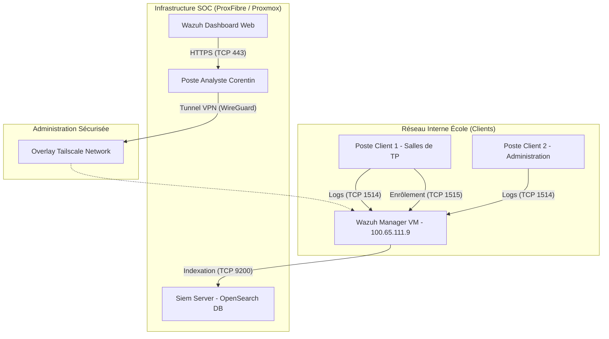

# Rapport de projet : mise en place d'un SOC avec Wazuh

* **Auteur :** Corentin
* **Cursus :** Master Cybersécurité / Ingénierie Réseaux & Systèmes
* **Sujet :** Déploiement, durcissement et industrialisation d'un SIEM Wazuh sur un réseau académique (Projet de Fin d'Études)
* **Encadrant / Correcteur Pédagogique :** [Nom de l'encadrant]
* **Date :** Juillet 2026

---

## Table des matières

1. Introduction
   * 1.1 Contexte et objectifs du projet
   * 1.2 Problématique de supervision des réseaux académiques
   * 1.3 Objectifs et livrables attendus
2. Spécification des besoins et analyse des risques
   * 2.1 Périmètre et cible de supervision
   * 2.2 La plateforme ProxFibre (Proxmox)
   * 2.3 Analyse des risques et vecteurs d'attaque
3. Architecture technique du SIEM Wazuh
   * 3.1 Pourquoi Wazuh ? Comparaison des solutions SIEM
   * 3.2 Topologie de déploiement
   * 3.3 Automatisation du déploiement via Ansible
   * 3.4 Sécurisation du Manager
4. Industrialisation du déploiement de masse (GPO Windows)
   * 4.1 Problématique de l'industrialisation
   * 4.2 Le script de déploiement durci PowerShell (v3.0.0)
   * 4.3 Gestion sécurisée des secrets d'enrôlement (DPAPI)
   * 4.4 Stratégie de groupe (GPO) : configuration et déploiement progressif
5. Règles de détection et conformité
   * 5.1 Règles de détection personnalisées (MITRE ATT&CK)
   * 5.2 Mappage avec les référentiels réglementaires
   * 5.3 Protocoles de validation et scénarios d'attaque
6. Bilan, difficultés et perspectives
   * 6.1 Difficultés rencontrées
   * 6.2 Guide de passation et maintenance du SOC
   * 6.3 Perspectives d'évolution
7. Conclusion

---

## Chapitre 1 : Introduction

### 1.1 Contexte et objectifs du projet

Les cybermenaces se professionnalisent et s'accélèrent. Dans ce contexte, la capacité à détecter rapidement les compromissions est devenue indispensable pour toute organisation — y compris les établissements d'enseignement. Ce projet part de ce constat : notre école ne disposait d'aucune visibilité centralisée sur les événements de sécurité de son réseau.

L'objectif principal était de concevoir un package de déploiement pour une infrastructure SOC (Security Operations Center) centralisée, basée sur le SIEM Wazuh. Je me suis positionné dans un rôle d'ingénieur/consultant en cybersécurité : ma mission n'était pas d'opérer le déploiement final sur le réseau de production, mais de livrer une solution « clé en main » sous forme d'Infrastructure as Code. Concrètement, j'ai fourni à l'équipe IT de l'école un kit complet, documenté et sécurisé, leur permettant d'obtenir une visibilité en temps réel sur les événements de sécurité de leur parc.

### 1.2 Problématique de supervision des réseaux académiques

Les réseaux d'établissements d'enseignement supérieur posent des défis de sécurité assez particuliers. D'abord, le parc est hétérogène et volatile : on retrouve côte à côte des équipements administratifs sensibles, des serveurs de TP étudiants et des postes de salles de cours partagés. Ensuite, le profil des utilisateurs est atypique — les étudiants en informatique manipulent régulièrement des outils de sécurité offensive dans le cadre de leurs TP, ce qui génère un bruit de fond important et un risque réel d'échappement de malware vers le réseau de production. Enfin, les ressources sont limitées : il faut des solutions open source sans frais de licence, tout en garantissant un niveau de fiabilité correct.

### 1.3 Objectifs et livrables attendus

Le projet s'est articulé autour de la livraison d'un « kit de déploiement SOC » en trois axes :

1. **Infrastructure as Code (IaC) :** des playbooks Ansible pour déployer le Manager Wazuh et la base d'indexation OpenSearch sur la plateforme d'hébergement interne ProxFibre.
2. **Déploiement à l'échelle :** un mécanisme d'installation automatisé pour les postes Windows via Active Directory (GPO), utilisant le chiffrement DPAPI et respectant les bonnes pratiques de l'ANSSI.
3. **Gouvernance et détection (GRC) :** des règles de détection mappées MITRE ATT&CK, des scripts de simulation d'attaques, un manuel de déploiement administrateur, et une cartographie de conformité (EBIOS RM, PCA/PRA, PSSI).

---

## Chapitre 2 : Spécification des besoins et analyse des risques

### 2.1 Périmètre et cible de supervision

L'établissement héberge un réseau à usages multiples. On a divisé le périmètre de supervision en trois zones logiques, chacune avec son niveau de criticité et ses profils d'utilisateurs.

La **zone pédagogique** regroupe environ 150 postes Windows 10/11 dans les salles de TP. L'utilisation y est intensive : les étudiants installent fréquemment des logiciels tiers, des environnements de développement, et exécutent toutes sortes de scripts. Le taux de faux positifs y est très élevé, parce que beaucoup d'activités légitimes ressemblent à des attaques (TP d'outils d'administration, requêtes PowerShell complexes...).

La **zone administrative** (direction, comptabilité, scolarité) comprend environ 30 postes sous Windows 10/11. Les tâches sont bureautiques classiques avec accès aux bases de données scolaires et financières. C'est la cible privilégiée pour le vol d'identifiants, le spear-phishing et les ransomwares — les utilisateurs y sont moins formés techniquement.

La **zone serveurs** couvre les services internes (Active Directory, DHCP, DNS, serveurs de fichiers) et les serveurs de TP. Le risque principal ici est l'escalade de privilèges et la compromission du contrôleur de domaine, qui entraînerait une prise de contrôle totale du réseau.

Pour un parc cible initial de 50 agents pilotes (mélange de TP et administratif), j'ai estimé le volume de logs à environ 1,5 Go par jour (15 à 20 événements par seconde en moyenne). Ça représente environ 45 Go par mois pour une rétention glissante de 30 jours, ce qui a justifié la demande d'extension du stockage à 200 Go sur notre serveur OpenSearch.

### 2.2 La plateforme ProxFibre (Proxmox)

L'infrastructure SOC est entièrement virtualisée sur la plateforme ProxFibre, un environnement de cloud privé sous hyperviseur Proxmox VE, géré par une équipe d'étudiants-administrateurs.

Ce setup implique des contraintes bien spécifiques. N'ayant pas d'accès direct avec les privilèges `root` sur l'hyperviseur, toute demande d'adaptation d'infrastructure (vCPU, RAM, extensions de stockage, DNS interne) nécessitait des fiches de demande formelles auprès des administrateurs de la plateforme. C'était contraignant, mais ça nous a forcés à bien documenter nos besoins.

Côté réseau, les VMs du SOC communiquent via un réseau overlay Tailscale (basé sur WireGuard), ce qui évite d'exposer l'administration du SIEM au LAN académique. On a aussi activé le QEMU Guest Agent dans nos VMs pour que Proxmox puisse figer les systèmes de fichiers (`fsfreeze`) lors des snapshots quotidiens à 2h00, et ainsi éviter la corruption des bases d'indexation.

### 2.3 Analyse des risques et vecteurs d'attaque

Pour concevoir des règles de détection pertinentes, on a réalisé un mappage des risques principaux du réseau de l'école :

| Scénario d'attaque | Probabilité | Impact | Mesure de mitigation | Couverture Wazuh & Sysmon |
|---|---|---|---|---|
| Exécution de Mimikatz / Dump LSASS | Élevée (TP ou malice étudiante) | Critique | Détection de l'accès en lecture à la mémoire de `lsass.exe` | Événement Sysmon ID 10 (ProcessAccess) intercepté par la règle 100002 |
| Ransomware sur partage réseau | Moyenne | Critique | Surveillance d'intégrité des fichiers (FIM) en temps réel | Alerte FIM (syscheck) déclenchée sur rafale de créations/suppressions |
| Brute-force Active Directory | Élevée | Majeure | Détection de rafale d'échecs de connexion sur le DC | Audit Log Windows Event ID 4625 agrégé par le Manager |
| Scripts PowerShell obfuscés / encodés | Élevée | Majeure | Analyse des lignes de commande PowerShell | Événement Sysmon ID 1 / Windows 4688 inspecté par regex |
| Mouvement latéral via WinRM / WMI | Moyenne | Majeure | Surveillance des process fils anormaux de `wsmprovhost.exe` ou `wmiprvse.exe` | Event ID 4624 (Type 3) + Sysmon |
| Installation d'outils d'accès distants (AnyDesk/TeamViewer) | Élevée | Moyenne | Contrôle de conformité (SCA) et détection de nouveaux services | Event ID 7045 + scan SCA |

Ce mappage montre clairement que la simple collecte des logs Windows par défaut ne suffit pas. Pour couvrir ces risques, le couplage de l'agent Wazuh avec Microsoft Sysmon est indispensable sur le périmètre Windows.

---

## Chapitre 3 : Architecture technique du SIEM Wazuh

### 3.1 Pourquoi Wazuh ? Comparaison des solutions SIEM

J'ai mené une étude comparative entre trois solutions du marché pour justifier le choix technique :

| Critère | Splunk (Standard) | ELK Stack (Elastic) | Wazuh SIEM |
|---|---|---|---|
| Coût des licences | Élevé (au volume de logs) | Gratuit (Basic) / Payant (Premium) | Gratuit & open source |
| Agents | Universal Forwarder (complexe) | Winlogbeat / Filebeat (collecteurs bruts) | Agent unifié & actif (FIM, SCA, réponse active) |
| Capacité XDR | Limitée sans modules payants | Basique | Native (conformité, intégrité) |
| Hébergement local | Faible (solution propriétaire américaine) | Moyenne (dépendance Elastic) | Forte (code ouvert, hébergement local) |

Le choix s'est porté sur Wazuh pour son architecture d'agent unifiée, combinant SIEM et détection/réponse sur les terminaux (EDR/XDR), le tout sans coût de licence.

### 3.2 Topologie de déploiement

L'infrastructure déployée sur ProxFibre repose sur une séparation des rôles pour les performances et la scalabilité :



### 3.3 Automatisation du déploiement via Ansible

Pour éviter toute configuration manuelle (et la « dérive de configuration » qui en découle), j'ai automatisé l'intégralité du déploiement avec Ansible.

Le playbook de production (`deploy_wazuh_manager.yml`) fait trois choses principales. D'abord, le durcissement de l'OS : configuration du pare-feu UFW pour restreindre l'accès aux ports d'administration (SSH, API 55000, Dashboard 443) et n'ouvrir que les ports nécessaires aux agents (TCP 1514/1515). Ensuite, le déploiement de Filebeat et OpenSearch avec injection du template de mapping et activation des protocoles de compatibilité. Enfin, la mise en place de sauvegardes quotidiennes via `cron` à 2h00 du matin — configuration, base d'agents (`client.keys`) et règles personnalisées, avec une rétention de 14 jours.

### 3.4 Sécurisation du Manager

La sécurisation du Manager est le point d'ancrage de la confiance du SOC. Si le Manager est compromis, un attaquant peut aveugler la supervision ou injecter de fausses alertes.

Côté pare-feu (UFW), on ferme tous les ports entrants par défaut. Seuls les flux d'enrôlement et de remontée de logs sont autorisés pour le sous-réseau de l'école. Pour l'administration, l'accès SSH et le Dashboard ne sont pas exposés sur le réseau local — ils passent par un VPN mesh via Tailscale (protocole WireGuard). Ça élimine le risque de brute-force SSH ou d'exploitation de vulnérabilités sur l'interface web par un utilisateur interne.

---

## Chapitre 4 : Industrialisation du déploiement de masse (GPO Windows)

### 4.1 Problématique de l'industrialisation

Installer un agent manuellement sur des dizaines de machines, c'est inenvisageable. Ça introduit des erreurs de configuration, ça prend du temps, et ça rend les mises à jour pénibles. La solution standard en environnement Active Directory, ce sont les Stratégies de Groupe (GPO).

Mais un déploiement GPO classique pose un problème de sécurité : l'agent Wazuh a besoin d'un secret (jeton ou mot de passe API) pour s'authentifier auprès du Manager. Intégrer ce secret en clair dans le script — souvent stocké sur le partage public `NETLOGON` — c'est une faille : n'importe quel utilisateur du domaine pourrait lire le script, voler le secret et enregistrer des machines fictives ou perturber le SOC.

### 4.2 Le script de déploiement durci PowerShell (v3.0.0)

Pour résoudre ce problème, on a développé le script `Deploy-WazuhAgent.ps1`. Voici les mécanismes de sécurité qu'on y a intégrés :

1. **Intégrité du binaire (SHA-256) :** avant toute exécution, le script calcule le hash SHA-256 du fichier `wazuh-agent.msi` et le compare à une empreinte de confiance codée en dur. Si quelqu'un remplace le MSI par un binaire piégé sur le partage réseau, l'installation est bloquée.
2. **Chiffrement des identifiants (DPAPI) :** le jeton API est chiffré, pas stocké en clair.
3. **Restriction des droits NTFS (ACLs) :** le fichier `client.keys` contenant la clé cryptographique de l'agent est verrouillé après l'enrôlement :
   ```powershell
   # Suppression de l'héritage et attribution exclusive des droits à SYSTEM et Administrateurs
   $Acl = Get-Acl $KeyPath
   $Acl.SetAccessRuleProtection($true, $false)
   $Acl.AddAccessRule((New-Object System.Security.AccessControl.FileSystemAccessRule("SYSTEM", "FullControl", "Allow")))
   $Acl.AddAccessRule((New-Object System.Security.AccessControl.FileSystemAccessRule("Administrators", "FullControl", "Allow")))
   Set-Acl $KeyPath $Acl
   ```
4. **Idempotence et logs d'audit :** le script vérifie si le service est déjà présent. Chaque action est consignée dans le journal d'événements Windows Application avec l'ID `8100` (succès) ou `8101` (erreur), ce qui facilite le diagnostic via l'Event Viewer.

### 4.3 Gestion sécurisée des secrets d'enrôlement (DPAPI)

Le chiffrement DPAPI (Data Protection API) de Windows est au cœur de la sécurisation des identifiants dans notre GPO. Il permet de chiffrer une donnée avec la clé cryptographique propre à la machine locale.

En phase de préparation, l'administrateur exécute `Initialize-WazuhDeployCredential.ps1` en fournissant les identifiants API. Le script produit une chaîne chiffrée propre au contexte de l'ordinateur :
```powershell
# Utilisation de DPAPI avec une entropie spécifique pour masquer le secret
$SecureString = ConvertTo-SecureString $PlainTextPassword -AsPlainText -Force
$EncryptedSecret = ConvertFrom-SecureString $SecureString -Key $CryptographicEntropy
```

En phase de déploiement, quand le script GPO s'exécute sous le compte `SYSTEM` de la machine cible, il utilise DPAPI pour déchiffrer le jeton API à la volée. La clé de déchiffrement étant liée à l'identité machine, un utilisateur standard — même connecté sur la même machine — ne peut pas déchiffrer ce secret. Et si le script est copié sur une clé USB et ouvert sur un autre ordinateur, le déchiffrement échoue immédiatement.

---

## Chapitre 5 : Règles de détection et conformité

### 5.1 Règles de détection personnalisées (MITRE ATT&CK)

Par défaut, Wazuh fournit un ensemble de règles génériques. Pour répondre aux risques spécifiques identifiés au chapitre 2, j'ai développé des règles de détection sur-mesure dans `custom_wazuh_rules.xml`. Elles s'appuient sur les logs enrichis de Sysmon et sont mappées sur la matrice MITRE ATT&CK.

#### A. Détection d'accès suspect au processus LSASS (MITRE T1003.001 - Credential Dumping)

Le dump de la mémoire de `lsass.exe` est la méthode standard pour extraire des mots de passe en clair ou des tickets Kerberos (via Mimikatz ou des dumps mémoire via le gestionnaire des tâches).

Règle configurée :
```xml
<rule id="100002" level="12">
  <if_sid>61600</if_sid> <!-- Log Sysmon standard -->
  <field name="win.eventdata.targetImage">(?i)\\\\lsass\\.exe</field>
  <field name="win.eventdata.grantedAccess">0x1010</field> <!-- Access requis par Mimikatz -->
  <description>SecOps - Alerte Critique : Accès suspect à la mémoire de LSASS (Vol d'identifiants possible)</description>
  <mitre>
    <id>T1003.001</id>
  </mitre>
</rule>
```

#### B. Détection de scripts PowerShell obfuscés (MITRE T1059.001)

Les attaquants utilisent souvent l'argument `-EncodedCommand` (ou ses alias `-e`, `-enc`) pour exécuter des scripts encodés en Base64 et contourner la détection par mots-clés.

Règle configurée :
```xml
<rule id="100003" level="9">
  <if_sid>61603</if_sid> <!-- Création de processus Sysmon -->
  <field name="win.eventdata.commandLine">(?i)-e(nc|ncode|ncodedcommand)?\s+[a-za-z0-9+/=]{30,}</field>
  <description>SecOps - Alerte : Exécution d'un script PowerShell encodé en Base64</description>
  <mitre>
    <id>T1059.001</id>
  </mitre>
</rule>
```

### 5.2 Mappage avec les référentiels réglementaires

Un aspect important du volet GRC de ce projet a été d'adosser l'implémentation technique aux référentiels de sécurité nationaux et internationaux.

#### 1. Guide d'hygiène informatique de l'ANSSI

Pour les recommandations R15 (journalisation) et R16 (centralisation), c'est couvert via l'agent Wazuh qui transmet en temps réel les journaux Windows et Sysmon vers le Manager. La R9 (moindre privilège) est respectée : le compte `svc_wazuh_deploy` utilisé pour la GPO est un simple utilisateur du domaine, sans droit d'administration. Pour la R10 (authentification forte), le mécanisme DPAPI en mode machine (`SYSTEM`) protège le secret d'authentification API contre la lecture par un utilisateur non privilégié.

#### 2. Contrôles CIS v8

Les contrôles CIS 8.11 et 8.12 (collecte et stockage des logs d'audit) sont couverts par la collecte automatisée sur une machine dédiée avec rétention de 30 jours minimum. Le CIS 4.1 (baseline sécurisée Windows) est adressé par le module SCA de Wazuh, qui analyse quotidiennement le parc par rapport au benchmark CIS Windows. En fin de projet, on a aussi appliqué des mesures de durcissement concrètes, comme la règle CIS 26005 imposant le verrouillage de compte après 5 échecs consécutifs (`net accounts /lockoutthreshold:5`), ce qui a fait remonter le score de conformité.

#### 3. Norme ISO/CEI 27001:2022

Pour les contrôles A.8.19 et A.8.24, chaque connexion agent-manager est chiffrée via TLS 1.3. La base `client.keys` est verrouillée par ACL sur chaque agent.

### 5.3 Protocoles de validation et scénarios d'attaque

Pour valider le SOC avant sa livraison, j'ai mis en place un protocole d'attaques simulées contrôlées (détaillé dans `attack_playbooks_and_detection_matrix.md`) :

1. **Simulation de vol d'identifiants (Dump LSASS) :**
   * Commande exécutée : `rundll32.exe C:\windows\System32\comsvcs.dll, MiniDump [PID_de_lsass] C:\temp\lsass.dmp full`
   * Résultat attendu : remontée immédiate d'une alerte de niveau 12 (critique) avec déclenchement de la règle 100002.
2. **Simulation d'exécution PowerShell encodée :**
   * Commande exécutée : `powershell.exe -EncodedCommand IAAoAE4AZQB3AC0ATwBiAGoAZQBjAHQAIABTAHkAcwB0AGUAbQAuAE4AZQB0AC4AVwBlAGIAQwBsAGkAZQBuAHQAKQAuAEQAbwB3AG4AbABvAGEAZABTAHQAcgBpAG4AZwAoACcAaAB0AHQAcAA6AC8ALwBlAHgAYQBtAHAAbABlAC4AYwBvAG0AJwApAA==`
   * Résultat attendu : log capturé par Sysmon, classé en alerte de niveau 9.

3. **Simulation d'attaque Brute Force locale :**
   * Action réalisée : exécution répétée de tentatives d'authentification en échec via script PowerShell, générant de multiples Event ID 4625.
   * Résultat attendu : remontée des alertes d'échec de connexion sur le Dashboard, couplée au verrouillage effectif du compte après 5 tentatives (règle CIS 26005 appliquée via `net accounts /lockoutthreshold:5`).

Le succès de ces tests valide le pipeline complet de détection : génération du log local → capture par l'agent → chiffrement du flux → analyse sur le Manager → indexation OpenSearch → visualisation Dashboard.

---

## Chapitre 6 : Bilan, difficultés et perspectives

### 6.1 Difficultés rencontrées

Comme dans tout projet d'infrastructure en environnement réel, on a rencontré pas mal de contraintes opérationnelles qui ont perturbé le planning initial.

Le premier blocage a été le délai d'accès aux droits administratifs Active Directory. La structure AD de l'école est gérée de manière très restrictive, et l'obtention des droits pour la liaison de GPO a pris plus de temps que prévu. Pour ne pas bloquer le projet, on a validé le script `Deploy-WazuhAgent.ps1` localement sur une VM de test en simulant le contexte `NT AUTHORITY\SYSTEM` avec `psexec`. Ça nous a permis de vérifier le bon fonctionnement du chiffrement DPAPI et des verrous NTFS avant le déploiement réel.

L'autre difficulté, c'était l'absence d'accès direct à l'hyperviseur Proxmox. Pour la sauvegarde automatique (snapshots) et l'extension de disque, il a fallu passer par des fiches de demande formelles auprès des administrateurs de ProxFibre. Paradoxalement, cette contrainte a été bénéfique : elle nous a forcés à documenter rigoureusement nos besoins d'infrastructure.

### 6.2 Guide de passation et maintenance du SOC

Un SOC n'est utile que s'il est maintenu dans le temps. Pour assurer la pérennité du système après la fin du projet, plusieurs livrables de passation ont été intégrés au dépôt Git :

1. Le guide de déploiement GPO (`gpo_deployment_guide.md`) : un guide pas-à-pas destiné au futur administrateur AD de l'école.
2. Le playbook Ansible autonome, qui permet de reconstruire ou mettre à jour le Manager sur une nouvelle VM Ubuntu en moins de 10 minutes.
3. Le script de monitoring Linux, qui alerte automatiquement par Syslog/e-mail en cas de défaillance des services ou d'expiration des certificats TLS.

### 6.3 Perspectives d'évolution

Ce projet pose les bases du SOC, mais plusieurs améliorations sont envisageables.

Le déploiement de Sysmon à l'échelle serait une évolution naturelle — le script GPO déploie déjà l'agent Wazuh, et on pourrait y intégrer l'installation automatisée de Sysmon avec un template de sécurité durci (type SwiftOnSecurity) pour maximiser les capacités de détection des processus.

L'intégration d'un SOAR (comme Shuffle) permettrait d'automatiser les réponses aux incidents. Par exemple, si une alerte de brute-force RDP est détectée, le SOAR pourrait automatiquement déclencher un appel API vers le pare-feu pour isoler l'IP attaquante.

Enfin, la centralisation des logs des serveurs Linux (serveurs web, DNS/DHCP) via l'installation d'agents Wazuh Linux ou via la collecte Syslog classique compléterait la couverture.

---

## Chapitre 7 : Conclusion

Ce projet de fin d'études m'a permis de concevoir, durcir et industrialiser une solution complète de détection et de centralisation des événements de sécurité au sein de notre établissement.

Sur le plan technique, les objectifs sont atteints. Le Manager Wazuh est fonctionnel et sécurisé derrière un VPN chiffré (Tailscale). Le script PowerShell d'enrôlement par GPO résout la problématique de la sécurité des secrets grâce au chiffrement DPAPI. Les tests de détection d'attaques (LSASS dump, PowerShell obfuscé) ont validé le pipeline complet de remontée d'alertes avec des règles personnalisées mappées MITRE ATT&CK.

Sur le plan professionnel, ce projet m'a permis de manipuler des technologies clés (Wazuh, Ansible, Active Directory, GPO) tout en appliquant une méthodologie de gestion des risques et de gouvernance (ANSSI, NIST). Il démontre qu'il est possible de construire un système de détection opérationnel à moindres coûts, adapté aux contraintes d'un réseau académique.
