# 📘 Rapport de Projet Académique : Mise en place et Industrialisation d'un SOC souverain avec Wazuh

* **Auteur :** Corentin
* **Cursus :** Master Cybersécurité / Ingénierie Réseaux & Systèmes
* **Sujet :** Déploiement, durcissement et industrialisation d'un SIEM Wazuh sur un réseau académique (Projet de Fin d'Études / Projet Annuel)
* **Encadrant / Correcteur Pédagogique :** [Nom de l'encadrant]
* **Date :** Juin 2026

---

## 📋 Table des Matières

1. **Introduction**
   * 1.1 Contexte et Objectifs du Projet
   * 1.2 Problématique de Supervision des Réseaux Académiques
   * 1.3 Gestion de Projet, Jalons et Livrables Attendus
2. **Spécification des Besoins et Analyse des Risques (Analyse Fonctionnelle)**
   * 2.1 Périmètre et Cible de Supervision
   * 2.2 La Plateforme ProxFibre (Proxmox)
   * 2.3 Analyse des Risques et Vecteurs d'Attaque (Risk Mapping)

3. **Architecture Technique du SIEM Wazuh**
   * 3.1 Pourquoi Wazuh ? Comparaison des Solutions SIEM
   * 3.2 Topologie de Déploiement (Manager & OpenSearch)
   * 3.3 Automatisation du Déploiement du Manager via Ansible
   * 3.4 Sécurisation du Manager (UFW, Tailscale, Sauvegardes)
4. **Industrialisation du Déploiement de Masse (GPO Windows)**
   * 4.1 Problématique de l'Industrialisation sur le Parc Informatique
   * 4.2 Le Script de Déploiement Durci PowerShell (v3.0.0)
   * 4.3 Gestion Sécurisée des Secrets d'Enrôlement (DPAPI)
   * 4.4 Stratégie de Groupe (GPO) : Configuration et Déploiement Progressif
5. **Règles de Détection et Mappage de Conformité (SecOps & GRC)**
   * 5.1 Règles de Détection Personnalisées (MITRE ATT&CK)
   * 5.2 Mappage avec les Référentiels Réglementaires (ANSSI, NIST, ISO 27001)
   * 5.3 Protocoles de Validation et Scénarios d'Attaque (Red Teaming)
6. **Bilan, Difficultés et Perspectives**
   * 6.1 Difficultés Rencontrées (Accès Réseau, Validation GPO)
   * 6.2 Guide de Passation et Maintenance du SOC
   * 6.3 Perspectives d'Évolution (SOAR, Collecte Syslog Linux)
7. **Conclusion**

---

## ✍️ Chapitre 1 : Introduction

### 1.1 Contexte et Objectifs du Projet
Dans un paysage numérique où les cybermenaces se professionnalisent et s'accélèrent, la capacité de détection précoce des compromissions est devenue un pilier fondamental de la résilience informatique. Ce projet s'inscrit dans cette démarche au sein de notre établissement, avec pour objectif principal la mise en place d'une infrastructure de supervision de sécurité de type **SOC (Security Operations Center)** souveraine, centralisée et industrialisée.

L'objectif est d'assurer la visibilité en temps réel sur les événements de sécurité survenant sur le parc informatique de l'école (comprenant les postes de travail des salles de cours, l'administration, ainsi que les serveurs de services) afin de réagir promptement aux incidents d'intrusion ou d'abus de ressources.

### 1.2 Problématique de Supervision des Réseaux Académiques
Les réseaux d'établissements d'enseignement supérieur présentent des défis de sécurité uniques et complexes :
* **Hétérogénéité et volatilité du parc :** Coexistence d'équipements administratifs critiques, de serveurs de TP étudiants et de postes de salles de cours partagés.
* **Profil d'utilisateurs à risque :** Les étudiants en informatique manipulent des outils de sécurité offensive dans le cadre de leurs travaux pratiques, générant un bruit de fond important et un risque élevé d'échappement de malware ou d'intrusions sur le réseau de production.
* **Ressources limitées :** Nécessité d'adopter des solutions open source sans frais de licence récurrents (souveraineté), tout en garantissant des performances de niveau entreprise (*production-grade*).

### 1.3 Objectifs et Livrables Attendus
Le projet s'est articulé autour de trois grands axes :
1. **Infrastructure SIEM :** Déploiement robuste du Manager Wazuh et de la base d'indexation des logs (OpenSearch) sur la plateforme d'hébergement interne **ProxFibre**.
2. **Déploiement à l'échelle :** Conception d'un mécanisme d'installation automatisé pour les postes Windows via Active Directory (GPO), respectant les meilleures pratiques de sécurité de l'ANSSI.
3. **Conformité & Détection :** Création de règles de détection spécifiques axées sur les tactiques du MITRE ATT&CK et cartographie de notre conformité vis-à-vis des guides d'hygiène de l'ANSSI et du NIST.

---

## ✍️ Chapitre 2 : Spécification des Besoins et Analyse des Risques

### 2.1 Périmètre et Cible de Supervision
L'établissement d'enseignement héberge un réseau informatique complexe à usages multiples. La spécification des besoins impose de diviser le périmètre de supervision en trois grandes zones logiques, chacune présentant un niveau de criticité et des profils d'utilisateurs distincts :

1. **La Zone Pédagogique (Salles de TP et postes étudiants) :**
   * **Population cible :** Environ 150 postes clients sous Windows 10/11 répartis dans les différentes salles de TP.
   * **Profil d'utilisation :** Utilisation intensive par les étudiants en informatique. Installation fréquente de logiciels tiers, d'environnements de développement, et exécution de scripts.
   * **Risques associés :** Très fort taux de faux positifs du fait d'activités légitimes ressemblant à des attaques (TP d'outils d'administration, requêtes PowerShell complexes).
2. **La Zone Administrative (Postes de direction, comptabilité, scolarité) :**
   * **Population cible :** Environ 30 postes sous Windows 10/11.
   * **Profil d'utilisation :** Tâches bureautiques classiques, accès aux bases de données scolaires et financières.
   * **Risques associés :** Cible privilégiée pour le vol d'identifiants, le phishing ciblé (spear-phishing) et l'introduction de ransomwares par manque de formation technique des utilisateurs.
3. **La Zone Serveurs (Services internes et hébergement TP) :**
   * **Population cible :** Serveurs d'infrastructures (Active Directory, serveurs de fichiers DHCP, DNS) et serveurs de TP (Linux/Windows).
   * **Risques associés :** Escalade de privilèges, compromission du contrôleur de domaine (Active Directory) entraînant une prise de contrôle totale du réseau.

*Estimation de la volumétrie des logs :* Pour un parc cible initial de 50 agents pilotes (mélange de TP et administratif), le volume de logs généré est estimé à environ **1,5 Go par jour** (soit environ 15 à 20 événements par seconde en moyenne). Cela impose des contraintes de stockage de l'ordre de 45 Go par mois pour conserver une rétention glissante à chaud de 30 jours, justifiant la demande d'extension du stockage à 200 Go sur notre serveur OpenSearch.

### 2.2 La Plateforme ProxFibre (Proxmox)
L'infrastructure SOC est entièrement virtualisée et hébergée sur la plateforme **ProxFibre**, un environnement de cloud privé géré par une équipe d'étudiants-administrateurs sous hyperviseur **Proxmox VE**. 

Cette configuration sous-tend des contraintes et opportunités spécifiques :
* **Dépendance administrative (Contrainte de non-accès hyperviseur) :** N'ayant pas d'accès direct avec les privilèges `root` sur l'hyperviseur Proxmox, toute demande d'adaptation d'infrastructure (allocation de ressources vCPU/RAM, extensions de stockage, création de plans de snapshots automatiques, ou enregistrements DNS de la zone `school.local`) nécessite la rédaction de fiches de demande formelles adressées aux administrateurs de la plateforme (voir [`fiche_demande_proxfibre.html`](file:///C:/Users/coren/OneDrive/Desktop/Projet-SIEM/docs/demandes/fiche_demande_proxfibre.html)).
* **Séparation logique réseau :** Les machines virtuelles du SOC communiquent par un réseau overlay Tailscale VPN chiffré, évitant ainsi d'exposer l'administration du SIEM à l'ensemble du LAN académique.
* **QEMU Guest Agent :** L'activation indispensable de cet agent logiciel au sein de nos VMs permet à l'hyperviseur Proxmox d'interagir proprement avec l'OS invité (Ubuntu 22.04) afin de figer les systèmes de fichiers (fsfreeze) lors des snapshots quotidiens à 2h00, évitant tout risque de corruption des bases de données d'indexation de logs.

### 2.3 Analyse des Risques et Vecteurs d'Attaque (Risk Mapping)
Afin de concevoir des règles de détection pertinentes, nous avons réalisé un mappage des risques informatiques majeurs ciblés sur le réseau de l'école :

| Scénario d'Attaque | Probabilité | Impact | Mesure de Mitigé / Moyen de Détection | Couverture Wazuh & Sysmon |
|---|---|---|---|---|
| **Exécution de Mimikatz / Dump LSASS** | Élevée (TP ou malice étudiante) | Critique | Détection de l'accès en lecture à la mémoire de `lsass.exe` | **Événement Sysmon ID 10** (ProcessAccess) intercepté par la règle personnalisée 100002. |
| **Ransomware sur partage réseau** | Moyenne | Critique | Surveillance d'intégrité des fichiers (FIM) en temps réel sur les répertoires sensibles | **Alerte FIM (syscheck)** déclenchée sur rafale de créations/suppressions rapides. |
| **Attaque Brute-Force Active Directory** | Élevée | Majeure | Détection de rafale d'échecs de connexion sur le contrôleur de domaine | **Audit Log Windows Event ID 4625** agrégé par le Manager Wazuh. |
| **Utilisation de scripts PowerShell obfuscés / encodés** | Élevée (Évasion de signature antivirale) | Majeure | Analyse des lignes de commande de démarrage de processus PowerShell | **Événement Sysmon ID 1 / Windows 4688** inspecté par regex (détection de `-EncodedCommand` ou `-e`). |
| **Mouvement latéral via WinRM / WMI** | Moyenne | Majeure | Surveillance du démarrage de processus fils anormaux de `wsmprovhost.exe` ou `wmiprvse.exe` | **Événement Windows ID 4624** (Type de connexion 3) + surveillance des process fils via Sysmon. |
| **Installation d'outils d'accès distants non autorisés (AnyDesk/TeamViewer)** | Élevée | Moyenne | Contrôle de conformité logicielle (SCA) et détection de nouveaux services installés | **Événement Windows ID 7045** (Nouveau service) + scan SCA périodique. |

Ce mappage montre que la simple collecte des logs par défaut de Windows est insuffisante. Pour couvrir la majorité de ces risques, le couplage de l'agent **Wazuh** avec le service **Microsoft Sysmon** (System Monitor) est une nécessité absolue sur le périmètre Windows.

---

## ✍️ Chapitre 3 : Architecture Technique du SIEM Wazuh

### 3.1 Pourquoi Wazuh ? Comparaison des Solutions SIEM
Pour structurer notre choix technique, une étude comparative a été réalisée entre trois solutions majeures du marché :

| Critère | Splunk (Standard) | ELK Stack (Elastic) | Wazuh SIEM |
|---|---|---|---|
| **Coût des Licences** | Élevé (au volume de logs injectés) | Gratuit (Basic) / Payant (Premium) | **Gratuit & Open Source** (complet) |
| **Agents** | Universal Forwarder (complexe à configurer) | Winlogbeat / Filebeat (collecteurs bruts) | **Agent Unifié & Actif** (FIM, SCA, Réponse active) |
| **Capacité XDR** | Limitée sans modules payants | Basique | **Native** (évaluation de la conformité, intégrité) |
| **Souveraineté** | Faible (solution propriétaire américaine) | Moyenne (dépendance vis-à-vis d'Elastic) | **Forte** (code ouvert, hébergement local strict) |

Le choix s'est porté sur **Wazuh** en raison de son architecture d'agent unifiée très puissante, combinant les fonctionnalités de SIEM traditionnel et de détection/réponse sur les terminaux (EDR/XDR), le tout sans coût de licence.

### 3.2 Topologie de Déploiement (Manager & OpenSearch)
L'infrastructure déployée sur la plateforme ProxFibre repose sur une séparation claire des rôles pour garantir les performances et la scalabilité :

```mermaid
graph TD
    subgraph "Réseau Interne École (Clients)"
        Client1[Poste Client 1 - Salles de TP] -- Logs (TCP 1514) --> Manager
        Client2[Poste Client 2 - Administration] -- Logs (TCP 1514) --> Manager
        Client1 -- Enrôlement (TCP 1515) --> Manager
    end

    subgraph "Infrastructure SOC (ProxFibre / Proxmox)"
        Manager[Wazuh Manager VM - 100.65.111.9] -- Indexation (TCP 9200) --> DB[Siem Server - OpenSearch DB]
        Dash[Wazuh Dashboard Web] -- HTTPS (TCP 443) --> Analyst[Poste Analyste Corentin]
    end

    subgraph "Administration Sécurisée"
        Analyst -- Tunnel VPN (WireGuard) --> Tailscale[Overlay Tailscale Network]
        Tailscale -.-> Manager
    end
```



### 3.3 Automatisation du Déploiement du Manager via Ansible
Pour éviter toute configuration manuelle ("dérive de configuration") et garantir la reproductibilité du SOC, l'intégralité du déploiement a été automatisée à l'aide d'Ansible. 

Le playbook durci de production (`deploy_wazuh_manager.yml`) réalise les opérations suivantes :
1. **Durcissement OS :** Configuration du pare-feu local (UFW) pour restreindre l'accès aux ports d'administration (SSH, API 55000, Dashboard 443) et n'ouvrir que les ports nécessaires aux agents (TCP 1514/1515).
2. **Déploiement Filebeat & OpenSearch :** Configuration sécurisée du connecteur Filebeat avec injection du template de mapping officiel et activation des protocoles de compatibilité API.
3. **Mise en place des Sauvegardes :** Création d'une tâche planifiée (`cron`) exécutant quotidiennement à 2h00 du matin une sauvegarde compressée des bases de données de configuration, de la base d'agents (`client.keys`) et des règles personnalisées, avec une rétention stricte de 14 jours.

### 3.4 Sécurisation du Manager (UFW, Tailscale, Sauvegardes)
La sécurisation du manager Wazuh constitue le point d'ancrage de la confiance du SOC. Si le manager est compromis, l'attaquant peut aveugler la supervision ou injecter de fausses alertes.
* **Pare-feu (UFW) :** Fermeture systématique de tous les ports entrants. Seul le flux d'enrôlement et de remontée de logs est autorisé pour le sous-réseau des ordinateurs de l'école.
* **Réseau privé virtuel (VPN) d'administration :** L'accès SSH et le Dashboard d'administration ne sont pas exposés sur le réseau de l'école. Ils sont reliés à un réseau privé virtuel de type Mesh via **Tailscale** (basé sur le protocole WireGuard). Cela élimine le risque d'attaques par force brute SSH ou d'exploitation de vulnérabilités sur l'interface web par un utilisateur malveillant interne.

---

## ✍️ Chapitre 4 : Industrialisation du Déploiement de Masse (GPO Windows)

### 4.1 Problématique de l'Industrialisation sur le Parc Informatique
Le déploiement manuel d'un agent de supervision sur des dizaines, voire des centaines de machines est inenvisageable. Il introduit des erreurs de configuration, consomme du temps et rend les mises à jour complexes. La solution standard en environnement Active Directory est l'utilisation des **Stratégies de Groupe (GPO)**.

Cependant, un déploiement par GPO classique pose un problème de sécurité majeur : l'agent Wazuh a besoin d'un **secret (jeton ou mot de passe d'API)** pour s'authentifier auprès du Manager et obtenir sa clé unique d'échange. Intégrer ce secret en clair dans le script de déploiement (souvent stocké sur le partage public `NETLOGON`) est une faille critique : n'importe quel étudiant ou utilisateur du domaine pourrait lire le script, voler le secret de l'API et enregistrer des machines fictives ou perturber le SOC.

### 4.2 Le Script de Déploiement Durci PowerShell (v3.0.0)
Pour répondre à cette problématique, nous avons développé le script [`Deploy-WazuhAgent.ps1`](file:///C:/Users/coren/OneDrive/Desktop/Projet-SIEM/scripts/windows/Deploy-WazuhAgent.ps1). Les améliorations apportées pour atteindre un niveau de sécurité digne d'une infrastructure de production (*production-grade*) sont :

1. **Intégrité du Binaire (SHA-256) :** Avant toute exécution, le script calcule le hash SHA-256 du fichier d'installation `wazuh-agent.msi` téléchargé ou lu sur le partage et le compare à une empreinte de confiance codée en dur. Cela empêche les attaques par remplacement de binaire (si un attaquant modifie le fichier MSI sur le partage réseau pour y injecter un cheval de Troie).
2. **Chiffrement des Identifiants (DPAPI) :** Le jeton de l'API d'authentification est chiffré.
3. **Restriction des Droits NTFS (ACLs) :** Le fichier local `client.keys` contenant la clé cryptographique propre à l'agent est immédiatement verrouillé après l'enrôlement :
   ```powershell
   # Suppression de l'héritage et attribution exclusive des droits de lecture/écriture à SYSTEM et aux Administrateurs
   $Acl = Get-Acl $KeyPath
   $Acl.SetAccessRuleProtection($true, $false)
   $Acl.AddAccessRule((New-Object System.Security.AccessControl.FileSystemAccessRule("SYSTEM", "FullControl", "Allow")))
   $Acl.AddAccessRule((New-Object System.Security.AccessControl.FileSystemAccessRule("Administrators", "FullControl", "Allow")))
   Set-Acl $KeyPath $Acl
   ```
4. **Idempotence & Logs d'Audit :** Le script vérifie la présence du service et sa configuration. Chaque action ou erreur est consignée dans le journal d'événements Windows Application avec l'ID d'événement `8100` (Succès) ou `8101` (Erreur) pour permettre le diagnostic rapide via l'Event Viewer.

### 4.3 Gestion Sécurisée des Secrets d'Enrôlement (DPAPI)
Le chiffrement DPAPI (Data Protection API) de Windows est le cœur de la sécurisation des identifiants dans notre GPO. Il permet de chiffrer une donnée en utilisant la clé cryptographique propre à la machine locale.

1. **Phase de préparation (Admin) :** 
   L'administrateur exécute le script `Initialize-WazuhDeployCredential.ps1` en fournissant les identifiants d'API. Le script produit une chaîne chiffrée propre au contexte de l'ordinateur :
   ```powershell
   # Utilisation de DPAPI avec une entropie spécifique pour masquer le secret
   $SecureString = ConvertTo-SecureString $PlainTextPassword -AsPlainText -Force
   $EncryptedSecret = ConvertFrom-SecureString $SecureString -Key $CryptographicEntropy
   ```
2. **Phase de déploiement (Machine cible) :**
   Lorsque le script de GPO s'exécute sous le compte `SYSTEM` de l'ordinateur cible, il utilise DPAPI pour déchiffrer à la volée le jeton d'API afin de s'authentifier auprès du Manager Wazuh.
   Puisque la clé de déchiffrement est liée à l'identité machine (`SYSTEM`), **un utilisateur standard, même connecté sur la même machine, est incapable de déchiffrer ce secret**. Si le script est copié sur une clé USB et ouvert sur un ordinateur personnel, le déchiffrement échouera immédiatement.

---

## ✍️ Chapitre 5 : Règles de Détection et Mappage de Conformité (SecOps & GRC)

### 5.1 Règles de Détection Personnalisées (MITRE ATT&CK)
Par défaut, Wazuh fournit un ensemble de règles génériques. Pour répondre aux besoins spécifiques et aux vecteurs de risques identifiés au Chapitre 2, nous avons développé des règles de détection sur-mesure dans [`custom_wazuh_rules.xml`](file:///C:/Users/coren/OneDrive/Desktop/Projet-SIEM/config/wazuh-manager/custom_wazuh_rules.xml). Ces règles s'appuient principalement sur les logs enrichis fournis par **Sysmon** pour intercepter les comportements suspects et sont mappées directement sur la matrice de techniques offensives **MITRE ATT&CK** :

#### A. Détection d'Accès Suspect au processus LSASS (MITRE T1003.001 - Credential Dumping)
Le dump de la mémoire du processus `lsass.exe` (Local Security Authority Subsystem Service) est la méthode standard pour extraire des mots de passe en clair ou des tickets Kerberos (via des outils comme Mimikatz ou des dumps mémoire via le gestionnaire des tâches).
* **Règle Wazuh configurée :**
  ```xml
  <rule id="100002" level="12">
    <if_sid>61600</if_sid> <!-- Log Sysmon standard -->
    <field name="win.eventdata.targetImage">(?i)\\\\lsass\\.exe</field>
    <field name="win.eventdata.grantedAccess">0x1010</field> <!-- Access restrictif requis par Mimikatz -->
    <description>SecOps - Alerte Critique : Accès suspect à la mémoire de LSASS (Vol d'identifiants possible)</description>
    <mitre>
      <id>T1003.001</id>
    </mitre>
  </rule>
  ```

#### B. Détection de Scripts PowerShell Obfusqués / Encodés (MITRE T1059.001 - PowerShell Command Execution)
Les attaquants utilisent fréquemment l'argument `-EncodedCommand` (ou ses alias raccourcis `-e`, `-enc`) pour exécuter des scripts complexes encodés en Base64 afin d'éviter la détection de mots-clés par les antivirus.
* **Règle Wazuh configurée :**
  ```xml
  <rule id="100003" level="9">
    <if_sid>61603</if_sid> <!-- Création de processus Sysmon -->
    <field name="win.eventdata.commandLine">(?i)-e(nc|ncode|ncodedcommand)?\s+[a-za-z0-9+/=]{30,}</field>
    <description>SecOps - Alerte : Exécution d'un script PowerShell encodé en Base64</description>
    <mitre>
      <id>T1059.001</id>
    </mitre>
  </rule>
  ```

### 5.2 Mappage avec les Référentiels Réglementaires (ANSSI, NIST, ISO 27001)
Un aspect crucial de la Gouvernance, Risque et Conformité (GRC) de ce projet a été d'adosser l'ensemble de notre implémentation technique aux référentiels et standards de sécurité nationaux et internationaux :

#### 1. Guide d'Hygiène Informatique de l'ANSSI
* **Recommandation 15 (Journalisation de l'activité) & R16 (Centralisation des journaux) :** Réalisé de manière souveraine via l'agent Wazuh transmettant en temps réel l'ensemble des journaux d'événements Windows (Event Viewer) et les logs additionnels Sysmon vers le Manager interne sécurisé.
* **Recommandation 9 (Moindre Privilège) :** Le compte de service `svc_wazuh_deploy` utilisé pour la GPO d'enrôlement est un compte utilisateur standard, membre du groupe `Domain Users` uniquement, dépourvu de tout droit d'administration sur le domaine AD.
* **Recommandation 10 (Authentification forte / Isolation) :** Grâce au mécanisme **DPAPI** configuré localement sur les machines cibles en mode machine (`SYSTEM`), le secret d'authentification API est stocké sous forme chiffrée, ce qui le protège contre la lecture et l'exfiltration par un utilisateur ou un administrateur non privilégié.

#### 2. Contrôles CIS v8 (Center for Internet Security)
* **CIS 8.11 (Collect Audit Logs) & CIS 8.12 (Address Audit Log Storage) :** Collecte automatisée et stockage centralisé des événements système sur une machine dédiée (`siem-server`) avec une politique de rétention minimale de 30 jours à chaud.
* **CIS 4.1 (Establish and Maintain a Secure Windows Baseline) :** Notre module SCA (Shared Configuration Assessment) de Wazuh analyse quotidiennement l'ensemble du parc par rapport au benchmark CIS Windows, fournissant une note globale de conformité et listant les clés de registre non conformes (ex: désactivation de SMBv1, activation de l'isolation LSA).

#### 3. Norme ISO/CEI 27001:2022
* **Contrôle A.8.19 (Product Security Auditing) & A.8.24 (Use of Cryptography) :**
  Chaque connexion réseau entre les agents et le manager Wazuh est entièrement encapsulée et chiffrée via TLS 1.3. La base d'agents `client.keys` est verrouillée par ACL local sur chaque agent cible.

### 5.3 Protocoles de Validation et Scénarios d'Attaque (Red Teaming)
Pour valider l'efficacité du SOC avant sa livraison aux équipes de l'école, un protocole d'attaques simulées contrôlées a été établi (détaillé dans [`attack_playbooks_and_detection_matrix.html`](file:///C:/Users/coren/OneDrive/Desktop/Projet-SIEM/docs/audit/attack_playbooks_and_detection_matrix.html)) :

1. **Simulation de vol d'identifiants (Dump LSASS) :**
   * *Commande exécutée sur le poste de test :* `rundll32.exe C:\windows\System32\comsvcs.dll, MiniDump [PID_de_lsass] C:\temp\lsass.dmp full`
   * *Résultat attendu :* Blocage de l'action ou remontée immédiate d'une alerte de niveau 12 (Critique) sur le Dashboard Wazuh avec déclenchement de la règle 100002.
2. **Simulation d'exécution PowerShell encodée :**
   * *Commande exécutée :* `powershell.exe -EncodedCommand IAAoAE4AZQB3AC0ATwBiAGoAZQBjAHQAIABTAHkAcwB0AGUAbQAuAE4AZQB0AC4AVwBlAGIAQwBsAGkAZQBuAHQAKQAuAEQAbwB3AG4AbABvAGEAZABTAHQAcgBpAG4AZwAoACcAaAB0AHQAcAA6AC8ALwBlAHgAYQBtAHAAbABlAC4AYwBvAG0AJwApAA==`
   * *Résultat attendu :* Log capturé par Sysmon, envoyé au Manager et classé en alerte de niveau 9 (Exécution de commande obfusquée).

Le succès de ces tests valide le pipeline de détection du SOC (Génération du log local -> Capture par l'agent -> Chiffrement du flux -> Analyse par regex sur le Manager -> Indexation dans OpenSearch -> Visualisation Dashboard).

---

## ✍️ Chapitre 6 : Bilan, Difficultés et Perspectives

### 6.1 Difficultés Rencontrées (Accès Réseau, Validation GPO)
Comme dans tout projet d'infrastructure de sécurité en environnement réel, plusieurs contraintes opérationnelles ont perturbé le planning initial, nécessitant des ajustements méthodologiques :
* **Délai d'accès aux droits administratifs Active Directory :** La structure AD de l'établissement étant gérée de manière très restrictive par la direction informatique de l'école, l'obtention des droits requis pour la liaison de GPO a pris plus de temps que prévu. Pour pallier ce blocage sans ralentir le projet, nous avons validé le script PowerShell `Deploy-WazuhAgent.ps1` localement sur une machine virtuelle de test clonée en simulant le contexte machine `NT AUTHORITY\SYSTEM` avec l'utilitaire `psexec`. Cela a permis de garantir le fonctionnement du chiffrement DPAPI et des verrous NTFS avant le déploiement généralisé.
* **Absence d'accès direct à l'hyperviseur Proxmox :** Ne disposant pas de droits d'administration globale sur la plateforme ProxFibre, la mise en place de la sauvegarde automatique (snapshots) et de l'extension de disque a nécessité une phase de négociation et de formalisation écrite (via nos fiches de demande). Cette contrainte a été bénéfique, car elle nous a forcé à documenter rigoureusement nos besoins d'infrastructure.

### 6.2 Guide de Passation et Maintenance du SOC
Un SOC n'est utile que s'il est maintenu dans le temps. Pour assurer la pérennité du système après la fin de ce projet, plusieurs livrables de passation ont été intégrés directement au dépôt Git :
1. **Le guide de déploiement GPO ([`gpo_deployment_guide.html`](file:///C:/Users/coren/OneDrive/Desktop/Projet-SIEM/docs/guides/gpo_deployment_guide.html)) :** Un guide pas-à-pas illustré destiné au futur administrateur Active Directory de l'école pour lier, tester et dépanner le déploiement de l'agent.
2. **Le playbook Ansible autonome :** Permettant de reconstruire ou de mettre à jour le Manager Wazuh sur une nouvelle VM Ubuntu en moins de 10 minutes.
3. **Le script de monitoring Linux :** Qui alerte automatiquement par Syslog/e-mail en cas de défaillance des services ou d'expiration des certificats SSL/TLS.

### 6.3 Perspectives d'Évolution (SOAR, Collecte Syslog Linux)
Ce projet pose les fondations du SOC, mais plusieurs axes d'amélioration peuvent être envisagés pour étendre ses capacités :
* **Déploiement de Sysmon à l'échelle :** Actuellement, le script de GPO déploie l'agent Wazuh. Une évolution naturelle serait d'y intégrer le déploiement silencieux automatisé de **Microsoft Sysmon** configuré avec un template de sécurité durci (ex: SwiftOnSecurity) pour maximiser les capacités de détection des processus.
* **Intégration d'un SOAR (Security Orchestration, Automation and Response) :** Connecter Wazuh à un SOAR open source (comme **Shuffle**) pour automatiser les réponses aux incidents. Par exemple, si une alerte critique de force brute RDP est détectée sur une machine, le SOAR pourrait automatiquement déclencher un appel API vers le pare-feu ou le commutateur pour isoler temporairement l'IP attaquante.
* **Centralisation des logs des serveurs Linux :** Étendre la collecte aux serveurs internes (serveurs web, serveurs DNS/DHCP) via l'installation d'agents Wazuh Linux ou via la collecte Syslog classique.

---

## ✍️ Chapitre 7 : Conclusion

La réalisation de ce projet de fin d'études a permis de concevoir, durcir et industrialiser une solution complète de détection et de centralisation des événements de sécurité (SIEM/SOC) au sein de notre établissement. 

Sur le plan technique, les objectifs sont pleinement atteints :
* Le manager Wazuh est fonctionnel et sécurisé derrière un réseau d'administration VPN chiffré (**Tailscale**).
* Le script PowerShell d'enrôlement par **GPO** résout la problématique majeure de la sécurité des secrets d'enrôlement grâce au chiffrement **DPAPI** localisé.
* Les tests de détection d'attaques (LSASS dump, PowerShell obfuscé) ont validé le pipeline complet de remontée d'alertes en s'appuyant sur des règles personnalisées mappées sur le référentiel **MITRE ATT&CK**.

Sur le plan professionnel, ce projet m'a permis de manipuler des technologies clés du marché (Wazuh, Ansible, Active Directory, GPO) tout en appliquant une méthodologie rigoureuse de gestion des risques et de gouvernance informatique (ANSSI, NIST). Il démontre qu'il est possible de bâtir un système de détection souverain et robuste à moindres coûts, parfaitement adapté aux contraintes budgétaires et techniques d'un réseau académique.

---

> [!NOTE]
> Ce document est conçu comme une base de travail pour la rédaction finale de ton rapport. Tu peux directement l'étoffer et le structurer dans ton traitement de texte (Word, LibreOffice) ou l'exporter au format PDF.

